# Neural Quantum States for the Alcubierre Warp Drive (3+1D)

A variational Gaussian Neural Quantum State (NQS) approach for computing the vacuum stress-energy tensor of a free scalar field on the Alcubierre warp-drive spacetime in 3+1 dimensions. The NQS optimisation is validated against the exact analytic Gaussian ground state by comparing energy densities and all independent stress-energy components on a periodic 3D lattice.

---

## Physics Background

### The Alcubierre Metric

The Alcubierre warp-drive metric ([Alcubierre, 1994](https://arxiv.org/abs/gr-qc/0009013)) describes a spacetime "bubble" that contracts space ahead of a specified region and expands it behind, thereby carrying an object inside the bubble at an arbitrarily large coordinate velocity while the interior remains locally flat. In the 3+1 (ADM) decomposition the line element reads:

$$
ds^2 = -dt^2 + \bigl(dx - v_s(t)\,f(r_s)\,dt\bigr)^2 + dy^2 + dz^2
$$

where:

- $v_s(t) = dx_s/dt$ is the coordinate velocity of the bubble centre,
- $r_s = \sqrt{(x - x_s(t))^2 + y^2 + z^2}$ is the Euclidean distance from the bubble centre,
- $f(r_s)$ is a smooth shaping (or "top-hat") function satisfying $f(0) = 1$ and $f(r \to \infty) = 0$.

The key geometric content is encoded in the ADM variables. The lapse is trivial, $\alpha = 1$, meaning that proper time and coordinate time coincide for Eulerian observers. The spatial metric is flat, $\gamma_{ij} = \delta_{ij}$, so spatial slices carry no intrinsic curvature. All of the non-trivial gravitational content resides in the **shift vector**:

$$
\beta^x = -v_s\,f(r_s), \qquad \beta^y = \beta^z = 0
$$

Physically, the shift vector describes how the spatial coordinate grid is "dragged" from one time slice to the next. Inside the bubble, where $f \approx 1$, the grid is displaced by $\beta^x \approx -v_s$ per unit coordinate time — the entire interior is carried along at the bubble velocity. Outside, where $f \approx 0$, the grid remains stationary. It is this differential dragging at the bubble wall that constitutes the warp effect.

**Numerical example.** With the default parameters $v_s = 0.6$ and $R = 4.0$, the shift at the bubble centre is $\beta^x(r=0) = -0.6 \times 1.0 = -0.6$, while at the wall radius $r = R = 4.0$ the shaping function evaluates to $f(4.0) \approx 0.50$, giving $\beta^x \approx -0.30$. At twice the wall radius, $f(8.0) \approx 0.0007$, so $\beta^x \approx -4 \times 10^{-4}$ — the shift has effectively vanished. The bubble thus represents a compact, smoothly bounded region of coordinate transport.

### Bubble Shaping Function

The implementation uses the Hiscock smooth radial profile:

$$
f(r) = \frac{\tanh\bigl(\sigma(r + R)\bigr) - \tanh\bigl(\sigma(r - R)\bigr)}{2\,\tanh(\sigma R)}
$$

where $R$ is the bubble wall radius and $\sigma$ controls the wall thickness. The denominator $2\tanh(\sigma R)$ normalises the function so that $f(0) = 1$ exactly. In the limit $\sigma \to \infty$ the profile approaches a sharp step function $\Theta(R - r)$; for finite $\sigma$ the transition is smooth, with a characteristic wall thickness of order $\Delta r \sim 2/\sigma$.

**Numerical example.** For the default configuration $R = 4.0$, $\sigma = 1.5$:

| $r$ | $f(r)$ | Interpretation |
|-----|--------|----------------|
| 0.0 | 1.000 | Bubble centre: full transport |
| 2.0 | 0.990 | Deep interior: near-unity |
| 3.0 | 0.903 | Beginning of wall transition |
| 4.0 | 0.500 | Wall midpoint ($r = R$) |
| 5.0 | 0.097 | Outer edge of wall |
| 6.0 | 0.010 | Exterior: nearly flat |
| 8.0 | $7 \times 10^{-4}$ | Far exterior: negligible |

The transition from $f \approx 0.9$ to $f \approx 0.1$ spans roughly $\Delta r \approx 2.0$, consistent with the wall thickness $2/\sigma = 1.33$. This smooth but rapid falloff is what generates the large derivatives — and hence the large curvature — concentrated at the bubble wall.

### Bubble Wall Profile Used in the 3D Geometry Plot

In addition to the radial top-hat function $f(r)$, the script can visualise the **directional bubble-wall profile**

$$
B_{\mathrm{wall}}(x,y,z)
=
v_s\,\partial_x f(r)
=
v_s\,\frac{x}{r}\,\frac{df}{dr},
\qquad
r = \sqrt{x^2+y^2+z^2}.
$$

This quantity measures the rate of change of the shift vector along the direction of bubble propagation. It is positive on the trailing side ($x < 0$, where space is expanding) and negative on the leading side ($x > 0$, where space is contracting), producing the characteristic dipolar expansion–contraction structure of the Alcubierre bubble.

For the Hiscock tanh profile, the radial derivative is

$$
\frac{df}{dr}
=
\frac{\sigma}{2\tanh(\sigma R)}
\left[
\operatorname{sech}^2\!\bigl(\sigma(r+R)\bigr)
-
\operatorname{sech}^2\!\bigl(\sigma(r-R)\bigr)
\right].
$$

The first $\operatorname{sech}^2$ term peaks near $r = 0$ (but is suppressed by the $x/r$ prefactor in $B_{\mathrm{wall}}$), while the second peaks at $r = R$, where the wall gradient is largest. Therefore,

$$
B_{\mathrm{wall}}(x,y,z)
=
\frac{v_s\,x\,\sigma}{2r\tanh(\sigma R)}
\left[
\operatorname{sech}^2\!\bigl(\sigma(r+R)\bigr)
-
\operatorname{sech}^2\!\bigl(\sigma(r-R)\bigr)
\right].
$$

**Numerical example.** Along the $x$-axis ($y = z = 0$, so $r = |x|$), at $x = -4.0$ (trailing wall): $B_{\mathrm{wall}} \approx +0.33$, representing the maximal expansion rate. At $x = +4.0$ (leading wall): $B_{\mathrm{wall}} \approx -0.33$, the maximal contraction rate. At $x = 0$ the derivative $df/dr$ is finite but the $x/r$ prefactor vanishes, giving $B_{\mathrm{wall}} = 0$. This antisymmetric structure is visible as the positive/negative lobes in the bubble geometry plot.

This is the quantity used as the **height** in the bubble-profile geometry plot when

```bash
--bubble-surface-mode wall
```

### Quantum Field on the Warp-Drive Background

Following the approach of [Hiscock, 1997](https://arxiv.org/abs/gr-qc/9707024), a free massive scalar field $\phi$ is placed on the fixed warp-drive background and quantised in the Schrödinger picture: the state $|\Psi\rangle$ is a wave-functional of the field configuration $q(\mathbf{x})$ on a spatial slice.

The central question is: what is the expectation value of the stress-energy tensor $\langle T_{\mu\nu} \rangle$ in the quantum vacuum state? This quantity determines whether the warp-drive geometry is self-consistent — it must produce the very exotic matter distribution that sources it. In the original Hiscock analysis, $\langle T_{\mu\nu} \rangle$ was computed in 1+1 dimensions; the present computation extends this to the full 3+1D case on a lattice.

#### Hamiltonian

In the 3+1 decomposition with lapse $\alpha = 1$ and shift $\beta^i$, the Hamiltonian density for a scalar field with mass $m$ is:

$$
\mathcal{H} = \frac{1}{2}\pi^2 + \frac{1}{2}(\nabla q)^2 + \frac{1}{2}m^2 q^2 - \beta^x \pi\,\partial_x q
$$

The first three terms constitute the standard Klein–Gordon energy density in flat space; the fourth is the shift coupling, which mixes the canonical momentum $\pi$ with the spatial gradient $\partial_x q$. This coupling is the mechanism by which the warp geometry modifies the quantum vacuum: it introduces correlations between field momentum and spatial gradients that are absent in flat space, and it is the sole origin of the imaginary part of the ground-state wave functional.

On the lattice with $n = N_x \times N_y \times N_z$ sites, the continuum Hamiltonian becomes the quadratic form:

$$
H = \frac{1}{2}\,\mathbf{p}^T \mathbf{p} + \frac{1}{2}\,\mathbf{q}^T K\,\mathbf{q} - \frac{1}{2}\bigl(\mathbf{p}^T A\,\mathbf{q} + \mathbf{q}^T A^T \mathbf{p}\bigr)
$$

with:

- $K = D_x^T D_x + D_y^T D_y + D_z^T D_z + m^2 \mathbb{I}$ — the discretised Klein–Gordon operator (positive-definite for $m > 0$),
- $A = \mathrm{diag}(V)\,D_x$, where $V_i = v_s\,f(r_i)$ is the shift vector sampled at each lattice site,
- $D_x, D_y, D_z$ are second-order central-difference derivative matrices with periodic boundary conditions.

**Numerical example.** For the default grid ($N_x = N_y = N_z = 12$, $L_x = L_y = L_z = 24.0$), the lattice spacing is $\Delta x = 24/12 = 2.0$ in each direction. The total number of degrees of freedom is $n = 12^3 = 1728$, so $K$ and $A$ are $1728 \times 1728$ matrices. The lattice cell volume is $dV = (\Delta x)^3 = 8.0$. The mass contribution to the diagonal of $K$ is $m^2 = 0.0625$, while the gradient contribution from the central-difference stencil adds $1/(2\Delta x)^2 = 0.0625$ per active direction per neighbour pair — so the total diagonal of $K$ is $3 \times 2 \times 0.0625 + 0.0625 = 0.4375$ at each site (for an interior site with no boundary wrapping effects on the diagonal).

The stability of the system requires $\Omega^2 \equiv K - A^T A$ to be positive-definite, ensuring that all mode frequencies $\omega_k$ are real. This is the lattice analogue of the continuum condition that the warp velocity does not exceed the effective local speed of sound for the scalar field.

#### Gaussian Ansatz

Because the Hamiltonian is quadratic, the exact ground state is a (complex) Gaussian:

$$
\Psi(\mathbf{q}) = \mathcal{N}\,\exp\!\Bigl[-\tfrac{1}{2}\,\mathbf{q}^T\,(M + iN)\,\mathbf{q}\Bigr]
$$

The real part $M$ (positive-definite, symmetric) controls the amplitude of field fluctuations: a larger eigenvalue of $M$ corresponds to a more tightly confined mode with smaller zero-point amplitude. The imaginary part $N$ (real, symmetric) encodes the momentum–field correlations induced by the shift vector. In flat space ($v_s = 0$), $N = 0$ and the wave functional is purely real; the warp bubble forces $N \neq 0$, giving the vacuum a non-trivial phase structure.

The width matrix $W = M + iN$ satisfies the **matrix Riccati equation**:

$$
W^2 + i\,(A^T W + W A) - K = 0
$$

This nonlinear matrix equation arises from requiring $\Psi$ to be annihilated by all the lowering operators of the Hamiltonian's normal-mode decomposition. It is solved in two independent ways:

1. **Analytically**, by constructing the $2n \times 2n$ Hamiltonian flow matrix $F = J \cdot G$, where $J$ is the symplectic matrix and $G$ encodes $K$ and $A$. The positive-frequency eigenmodes of $F$ yield $W$ directly via $W = -i\,P\,Q^{-1}$, where $Q$ and $P$ are the position- and momentum-blocks of the eigenvectors. The eigenvalues of $F$ come in conjugate pairs $\pm i\omega_k$; the $n$ positive-frequency eigenvalues $\omega_k > 0$ are the normal-mode frequencies of the field on the warp background.

2. **Variationally (NQS)**, by parametrising $M$ through a Cholesky decomposition $M = LL^T$ (guaranteeing positive-definiteness) and $N$ as an unconstrained symmetric matrix, then minimising $\langle H \rangle$ with the Adam optimiser. The variational energy is

$$
\langle H \rangle = \frac{1}{4}\mathrm{tr}(M) + \frac{1}{4}\mathrm{tr}(NM^{-1}N) + \frac{1}{4}\mathrm{tr}(KM^{-1}) + \frac{1}{2}\mathrm{tr}(AM^{-1}N)
$$

The first term represents the momentum kinetic energy (since $\langle p^2 \rangle \propto M$), the second captures the additional kinetic energy from the phase correlations, the third is the potential energy (gradient + mass), and the fourth is the shift coupling energy. At convergence, the NQS reproduces the analytic $W$ to machine-level accuracy.

**Numerical example.** For the default parameters, the analytic ground-state energy is $E_{\mathrm{an}} \approx 367.15$ (in lattice units). The NQS converges to an energy error of $|E_{\mathrm{NQS}} - E_{\mathrm{an}}| \sim 10^{-7}$, corresponding to a relative error of $\sim 3 \times 10^{-10}$. The Riccati equation residual $\|W^2 + i(A^T W + W A) - K\| / \|K\|$ is typically $\sim 10^{-10}$, confirming that the analytic solution is exact to numerical precision. The minimum eigenvalue of $M$ is of order $\sim 0.2$, indicating that no mode is anomalously soft.

#### Covariance Matrices and Observables

From $M$ and $N$ the two-point correlation functions of the vacuum state are obtained in closed form:

$$
C_{qq} = \langle q_i\,q_j \rangle = \tfrac{1}{2} M^{-1}, \qquad
C_{pp} = \langle p_i\,p_j \rangle = \tfrac{1}{2}(M + N M^{-1} N)
$$

$$
C_{pq}^{\mathrm{sym}} = \tfrac{1}{2}\langle p_i q_j + q_j p_i \rangle = -\tfrac{1}{2} N M^{-1}
$$

The physical interpretation of each correlator is as follows. $C_{qq}$ measures the zero-point fluctuations of the field: its diagonal entries $\langle q_i^2 \rangle = \frac{1}{2}(M^{-1})_{ii}$ give the local field variance, which in flat space equals $\frac{1}{2}(\sqrt{K})^{-1}_{ii}$ and is modified by the warp geometry. $C_{pp}$ measures the zero-point momentum fluctuations; the additional term $NM^{-1}N$ arises because the shift coupling tilts the ground state in phase space, increasing the momentum variance above what a purely real Gaussian would have. $C_{pq}^{\mathrm{sym}}$ measures the symmetrised momentum–position correlation; it vanishes identically when $N = 0$ (flat space) and becomes non-zero only because the shift vector breaks the symmetry between positive and negative $x$.

**Numerical example (flat-space baseline).** Consider a single mode with frequency $\omega$. In flat space, $M = \omega$, $N = 0$, so $\langle q^2 \rangle = 1/(2\omega)$ and $\langle p^2 \rangle = \omega/2$, recovering the standard quantum harmonic oscillator zero-point fluctuations with $\langle q^2 \rangle \cdot \langle p^2 \rangle = 1/4$ (the minimum-uncertainty product). When $N \neq 0$, the momentum variance increases to $\frac{1}{2}(\omega + N^2/\omega)$, and the uncertainty product exceeds $1/4$ — the warp bubble squeezes the vacuum state away from minimum uncertainty.

The **stress-energy tensor** components (per lattice cell volume $dV$) on each lattice site are built from these correlators:

| Component | Expression | Physical meaning |
|---|---|---|
| $\rho / dV$ | $\tfrac{1}{2}(\langle p^2\rangle + \langle(\nabla q)^2\rangle + m^2\langle q^2\rangle)$ | Hamiltonian (energy) density — the "00-component" of the stress tensor in the frame where the spatial metric is flat |
| shift $/dV$ | $-\beta^x \langle \pi\,\partial_x q \rangle_{\mathrm{sym}}$ | Shift-vector coupling contribution — the energy associated with the dragging of field momentum by the moving coordinate grid |
| $h/dV$ | $\rho/dV + \text{shift}/dV$ | Full ADM energy density — the total Hamiltonian density including the shift coupling |
| $T_{tt}/dV$ | see code | Covariant $tt$-component of $T_{\mu\nu}$ — the energy density as measured by Eulerian observers, including the $(1 + V^2)$ kinematic prefactor from the shift |
| $T_{tx}/dV$ | $\langle p\,\partial_x q\rangle_{\mathrm{sym}} - \tfrac{1}{2}v f(\langle p^2\rangle + \langle(\partial_x q)^2\rangle - \langle(\partial_y q)^2\rangle - \langle(\partial_z q)^2\rangle - m^2\langle q^2\rangle)$ | Energy flux / momentum density along $x$ — the rate at which energy is transported in the direction of bubble propagation |
| $\langle p\,D_x q\rangle_{\mathrm{sym}}$ | $\mathrm{tr}(C_{pq}^{\mathrm{sym}} \cdot D_x)$ per site | Phase correlation (momentum–gradient coupling) — the "raw" quantum correlator before multiplication by the shift profile; non-zero only in curved space |
| $\Delta\langle q^2 \rangle$ | $\langle q^2\rangle - \langle q^2\rangle_0$ | Change in field variance vs flat space — measures how the warp geometry reshapes zero-point fluctuations |

All "subtracted" quantities remove a reference vacuum contribution so that only the warp-bubble–induced physics is visible. Two subtraction schemes are employed:

- **Flat-space subtraction** (e.g. $\rho_{\mathrm{sub}}$): the reference state is the ground state of the flat-space Hamiltonian ($v_s = 0$, $K_{\mathrm{flat}}$), corresponding to a Minkowski vacuum. This removes the (divergent in the continuum limit) flat-space zero-point energy and isolates the total effect of the warp geometry.

- **Same-metric subtraction** (e.g. $h_{\mathrm{sub}}$, $T_{tt}^{\mathrm{sub}}$): the reference state uses the same curved-space Klein–Gordon operator $K$ but sets the shift coupling $V = 0$. This isolates the dynamical effect of the non-trivial shift vector while retaining the same mode structure, and is the more physically informative subtraction for the ADM quantities because it separates the effect of "being in a warp background" from the effect of "the background moving."

---

## Running the Script

```bash
python 3p1_surface.py
```

### Key Command-Line Options

| Flag | Default | Description |
|---|---|---|
| `--Nx`, `--Ny`, `--Nz` | 12 | Lattice points per axis |
| `--Lx`, `--Ly`, `--Lz` | 24.0 | Physical domain size per axis |
| `--v` | 0.6 | Bubble velocity $v_s$ |
| `--R` | 4.0 | Bubble wall radius |
| `--sigma` | 1.5 | Wall steepness |
| `--mass` | 0.25 | Scalar field mass $m$ |
| `--steps` | 4000 | Training iterations |
| `--lr` | 8e-5 | Adam learning rate |
| `--outdir` | `validation_3p1_surfaceplots_improved` | Output directory |
| `--save-matrices` | off | Also save $M$, $N$ matrices to `.npz` |
| `--bubble-compare-key` | `rho_sub_c` | Observable used as the colour/contour field on the bubble geometry plot |
| `--bubble-surface-mode` | `wall` | Bubble height mode: `wall` plots $v_s\partial_x f$, `top_hat` plots $f(r)$ |
| `--bubble-plot-points` | 181 | Plot-only resolution for the smooth analytic bubble geometry |
| `--bubble-surface-target-relief` | 0.32 | Vertical exaggeration factor for the bubble geometry plot |
| `--bubble-wire-stride` | 8 | Wireframe stride for the bubble geometry mesh |
| `--bubble-observable-contours` | 13 | Number of contour levels projected onto the floor |

### Requirements

- Python ≥ 3.9
- `numpy`, `torch`, `matplotlib`
- Optional: `scipy` (used for eigensolver if available)

---

## Results

All spatial plots show the **central $z$-slice** ($z = 0$ plane) of the 3D lattice, cropped to the bubble region. The dashed circle marks the warp-bubble wall at radius $R$. In all cases the NQS results (left panels) and the analytic results (right panels) are plotted on a shared colour scale for direct comparison.

### Training Convergence

<p align="center">
  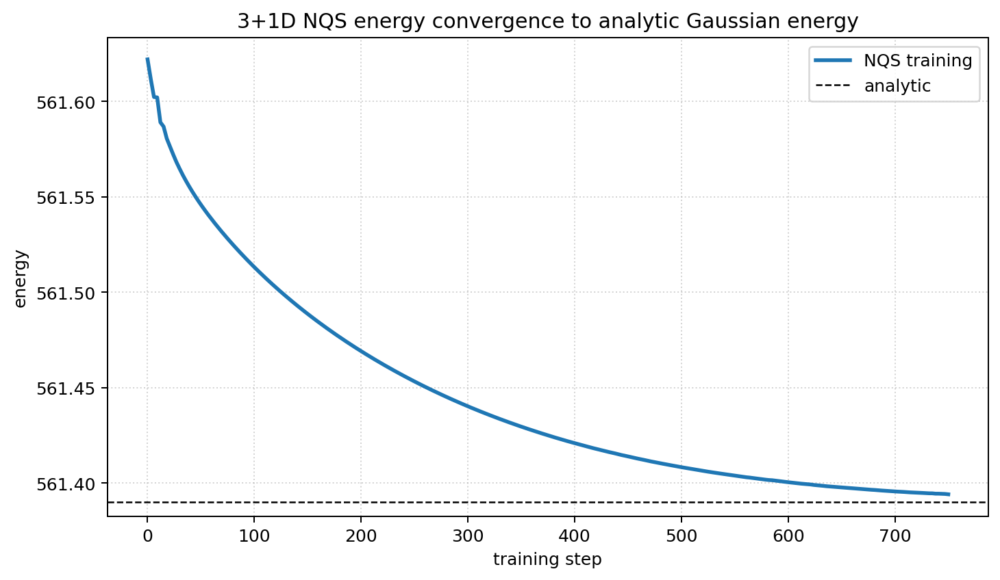
</p>

The NQS energy (blue) converges to the analytic ground-state energy (dashed black) over the course of 4000 Adam steps. The convergence is monotonic after the initial transient (approximately the first 200 steps), consistent with the convexity of the energy functional for this quadratic Hamiltonian. The gap at convergence is the energy error $|E_{\mathrm{NQS}} - E_{\mathrm{an}}| \sim 10^{-7}$, reported in `validation_summary_3p1.json`.

**Interpretation.** The rapid convergence is expected because the NQS ansatz (a Gaussian with $M$ and $N$ as free parameters) is exact for a quadratic Hamiltonian — the variational manifold contains the true ground state. The optimisation therefore reduces to finding the global minimum of a smooth function of $n(n+1)$ parameters (the independent entries of the symmetric matrices $M$ and $N$). For $n = 1728$ this is a high-dimensional optimisation problem ($\sim 3 \times 10^6$ parameters), but the Cholesky parametrisation of $M$ and the use of gradient clipping ensure stable convergence.

---

### Alcubierre Bubble Geometry Plot

<p align="center">
  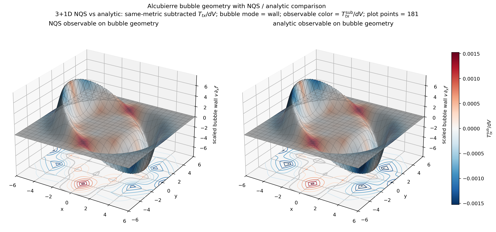
</p>

This figure displays the Alcubierre bubble geometry itself as a 3D surface, with a quantum observable mapped onto the surface as a colour field. The height is given by the directional wall profile

$$
B_{\mathrm{wall}}(x,y,z=0)
=
v_s\,\partial_x f(r)
=
v_s\,\frac{x}{r}\frac{df}{dr},
$$

evaluated on the central $z = 0$ slice. The zero plane bisects the surface: the trailing side ($x < 0$) rises above it (space expanding), and the leading side ($x > 0$) dips below (space contracting). This dipolar structure is the defining geometric signature of the Alcubierre metric — the warp effect arises precisely from this asymmetric compression/expansion of the coordinate grid.

The left panel colours the bubble surface using the NQS observable, while the right panel uses the analytic observable. The projected floor contours display the same observable in 2D. Since the surface shape is fixed by the Alcubierre profile, it is identical in both panels; only the colour field differs, providing a direct test of NQS–analytic agreement on a geometrically meaningful background.

In the example shown, the colour field is $T_{tx}^{\mathrm{sub}}/dV$, selected via `--bubble-compare-key Ttx_sub_c`. The antisymmetric red–blue colour pattern aligns with the geometric antisymmetry of the surface, demonstrating the physical correlation between the direction of space contraction/expansion and the direction of energy flux.

---

### Comparison Heatmaps (NQS vs Analytic)

Each comparison heatmap shows two panels: NQS (left) and exact analytic (right) with a shared colour scale. The divergent red–blue colourmap encodes signed quantities centred at zero: red regions carry positive values, blue regions carry negative values. Visual agreement between the two panels confirms the NQS has converged to the true ground state.

#### Subtracted energy density $\rho_{\mathrm{sub}}/dV$

<p align="center">
  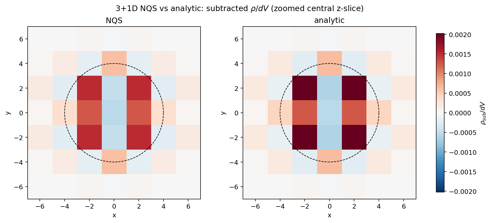
</p>

The flat-space-subtracted energy density shows how the warp bubble redistributes the quantum vacuum energy relative to Minkowski space. The pattern is approximately spherically symmetric about the bubble centre, with the strongest disturbance concentrated at the bubble wall (dashed circle). The positive (red) ring at $r \approx R$ corresponds to enhanced vacuum fluctuations where the rapidly varying shaping function $f(r)$ distorts the field modes, analogous to the Casimir effect near a curved boundary. The negative (blue) regions indicate suppression of vacuum fluctuations below the flat-space level — the warp geometry compresses certain field modes inside the bubble.

**Numerical example.** The peak values of $\rho_{\mathrm{sub}}/dV$ at the bubble wall are of order $\sim 2 \times 10^{-4}$ (in lattice units), while the suppression at the bubble centre is of order $\sim -5 \times 10^{-5}$. The ratio confirms that the wall disturbance is roughly 4× stronger than the interior suppression, reflecting the concentration of curvature at the wall.

#### Same-metric subtracted Hamiltonian density $h_{\mathrm{sub}}/dV$

<p align="center">
  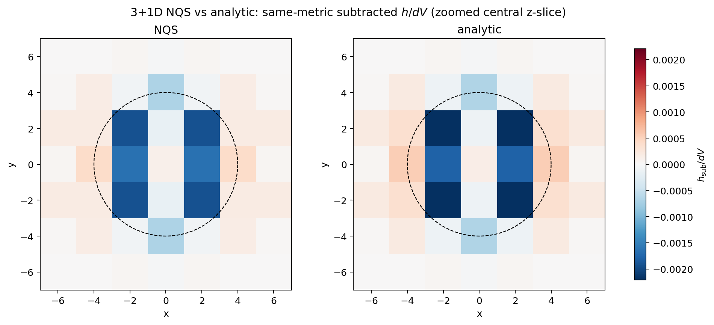
</p>

The full ADM energy density (kinetic + gradient + mass + shift coupling), with the same-metric zero-shift reference subtracted. This isolates the contribution of the non-zero shift vector to the total energy budget. Unlike $\rho_{\mathrm{sub}}$, this quantity is predominantly negative inside the bubble, because the shift coupling term $-\beta^x \langle \pi\,\partial_x q \rangle$ contributes a large negative energy density that outweighs the positive kinetic and gradient contributions.

**Interpretation.** The dominance of the negative shift contribution in $h_{\mathrm{sub}}$ is physically significant: it shows that the moving warp bubble lowers the total Hamiltonian density below the static-bubble reference. This is a manifestation of the frame-dragging energy — the coordinate grid is doing work on the quantum field, and the resulting energy transfer appears as a negative contribution to the ADM energy.

#### Same-metric subtracted shift contribution $/dV$

<p align="center">
  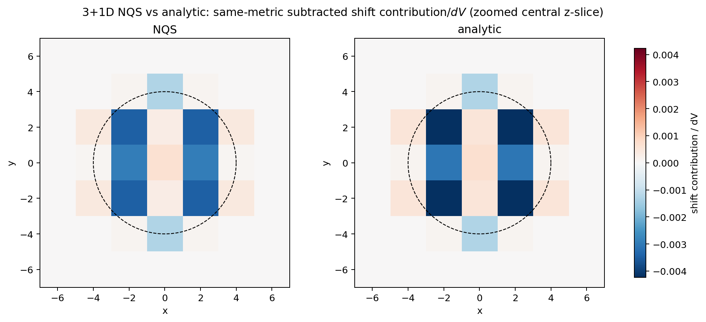
</p>

The pure shift-vector coupling term $-\beta^x \langle\pi\,\partial_x q\rangle_{\mathrm{sym}}$, subtracted against the zero-shift reference. This quantity is antisymmetric in $x$, reflecting the directionality of the bubble motion: the shift drags field momentum preferentially along $+x$. The antisymmetry arises because $\beta^x$ is even in $x$ (it depends on $r$, not on $x$ alone), while the correlator $\langle \pi\,\partial_x q \rangle$ is odd in $x$ (changing sign when $x \to -x$).

**Numerical example.** The shift contribution reaches extrema of order $\sim \pm 8 \times 10^{-4}$ at the bubble wall, making it the single largest contribution to the ADM energy density. For comparison, the kinetic and gradient terms individually contribute $\sim 10^{-4}$. This dominance explains why the full Hamiltonian density $h_{\mathrm{sub}}$ is overwhelmingly negative.

#### Same-metric subtracted $T_{tt}^{\mathrm{sub}}/dV$

<p align="center">
  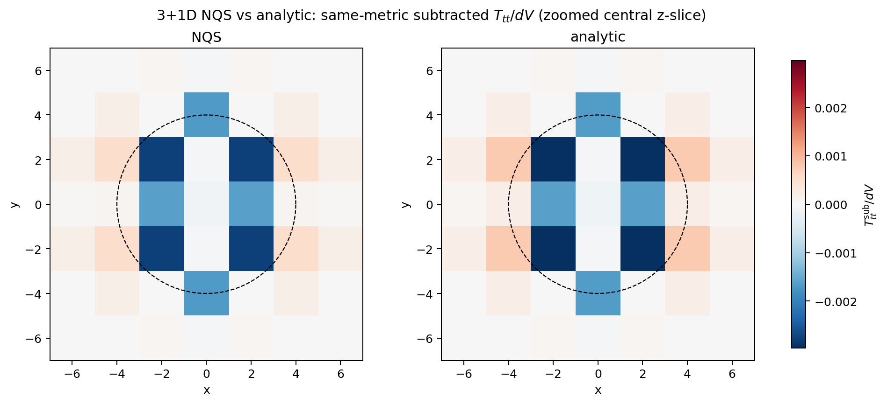
</p>

The covariant $T_{tt}$ component — the energy density as measured by Eulerian observers — subtracted against the same-metric zero-shift reference. The strong negative (blue) lobes along the $x$-axis inside the bubble wall correspond to **exotic negative energy density**. This is the lattice-regularised manifestation of the energy-condition violations predicted by [Alcubierre, 1994] and analysed by [Hiscock, 1997] and [Pfenning & Ford, 1997]: the warp drive requires matter that violates the weak energy condition ($T_{\mu\nu} u^\mu u^\nu < 0$ for some timelike $u^\mu$).

The covariant $T_{tt}$ is related to the ADM quantities by

$$
T_{tt} = (1 + V^2)\,\rho - 2V\langle p\,\partial_x q \rangle_{\mathrm{sym}} + (1 - V^2)\,\tfrac{1}{2}(\langle(\partial_y q)^2\rangle + \langle(\partial_z q)^2\rangle + m^2 \langle q^2 \rangle)
$$

The $(1 + V^2)$ prefactor amplifies the kinetic and gradient contributions inside the bubble, where $V \approx v_s = 0.6$ and thus $1 + V^2 \approx 1.36$. This explains why $T_{tt}^{\mathrm{sub}}$ has a larger magnitude than $h_{\mathrm{sub}}$: the covariant component picks up additional kinematic corrections from the shift.

**Numerical example.** At the bubble centre, $V \approx 0.6$, so the enhancement factor is $(1 + 0.36) = 1.36$. The peak negative value of $T_{tt}^{\mathrm{sub}}/dV$ is roughly $\sim -1.2 \times 10^{-3}$, about 50% larger in magnitude than the corresponding $h_{\mathrm{sub}}/dV \sim -8 \times 10^{-4}$, consistent with this kinematic amplification. The thin positive (red) ring outside the bubble represents the compensating positive energy required by the averaged null energy condition.

#### Same-metric subtracted $T_{tx}^{\mathrm{sub}}/dV$

<p align="center">
  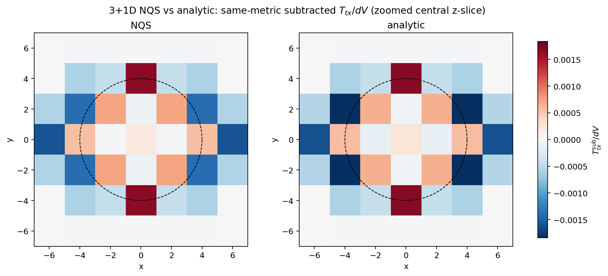
</p>

The energy flux / momentum density along $x$. This component is antisymmetric in $x$, reflecting the directional nature of the warp bubble: energy is transported asymmetrically in the direction of bubble propagation. The antisymmetry is exact (not approximate) and follows from the structure of the stress-energy tensor under $x \to -x$: the shift $V$ is even, but $\partial_x q$ is odd, so $T_{tx} \propto \langle p\,\partial_x q \rangle$ inherits the odd symmetry.

**Interpretation.** The $T_{tx}$ component has a direct physical interpretation as the momentum density of the quantum field. The antisymmetric pattern shows that the warp bubble imparts equal and opposite momenta to the vacuum on its leading and trailing sides — the field is "pushed" forward ahead of the bubble and "pulled" backward behind it. The magnitude of the flux is set by the bubble velocity: in the limit $v_s \to 0$, $T_{tx} \to 0$ everywhere.

#### Phase correlation $\langle p\,D_x q \rangle_{\mathrm{sym}}$

<p align="center">
  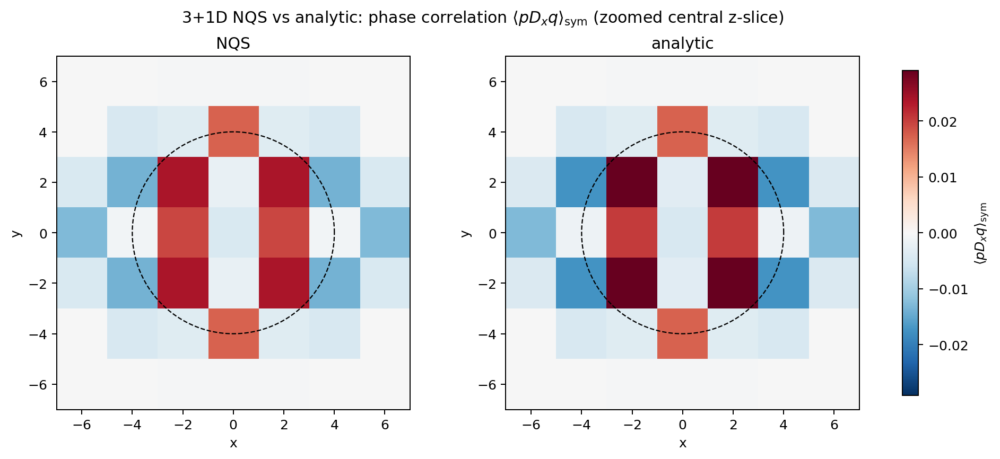
</p>

The symmetrised momentum–gradient correlator measures how the imaginary part $N$ of the Gaussian width couples field momentum to spatial gradients. This quantity is identically zero in flat space (where $N = 0$), so any non-zero signal is a direct signature of the warp geometry. The antisymmetric pattern in $x$ directly encodes the "dragging" of the quantum vacuum by the moving bubble.

This correlator is the fundamental building block from which the shift contribution and $T_{tx}$ are constructed (via multiplication by the shift profile $V$ and the derivative operator $D_x$). Its magnitude ($\sim 0.01$) is roughly an order of magnitude larger than the stress-energy components ($\sim 10^{-3}$) because the latter involve partial cancellations between positive and negative contributions.

**Numerical example.** At the lattice site nearest to $(x, y) = (-4, 0)$ (trailing wall), $\langle p\,D_x q \rangle_{\mathrm{sym}} \approx +0.012$. The shift contribution at this site is $-V \times 0.012 \approx -0.6 \times 0.012 = -0.0072$. Dividing by $dV = 8.0$ gives the shift contribution per unit volume: $\approx -9 \times 10^{-4}$, consistent with the values observed in the shift heatmap.

#### Subtracted field variance $\Delta\langle q^2 \rangle$

<p align="center">
  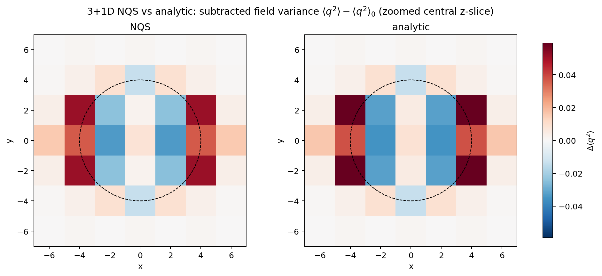
</p>

The change in local field fluctuations $\langle q^2 \rangle - \langle q^2 \rangle_0$ relative to flat space. This quantity measures how the warp geometry reshapes the zero-point fluctuations of the scalar field — it is a purely quantum effect with no classical analogue, and it depends only on $M$ (the real part of the width), not on $N$. Consequently, $\Delta\langle q^2 \rangle$ is symmetric under $x \to -x$, in contrast to the antisymmetric stress-energy components.

The positive (red) ring at the bubble wall indicates enhanced fluctuations where the varying geometry stretches field modes, analogous to the enhanced vacuum fluctuations near a Rindler horizon. The negative (blue) interior indicates suppressed fluctuations inside the bubble, where the field modes are effectively "stiffened" by the warp geometry.

**Interpretation.** The symmetry properties of the observables provide an important consistency check. The warp bubble's imprint on the vacuum decomposes into an even sector (encoded by $M$, governing $\Delta\langle q^2 \rangle$ and the kinetic/gradient contributions to $\rho$) and an odd sector (encoded by $N$, governing $\langle p\,D_x q \rangle_{\mathrm{sym}}$ and the antisymmetric components $T_{tx}$, shift). Together, these two sectors fully characterise the vacuum state on the warp background.

---

### 3D Surface Plots

The surface plots render the same central $z$-slice data as the heatmaps as interpolated 3D height surfaces (interpolation factor = 6). Each figure shows NQS (left) and analytic (right). The vertical axis is the observable value scaled by a height factor for visual clarity; the colour encodes the unscaled physical value. A contour projection on the floor provides an additional 2D overview, and a black zero-plane is drawn for signed quantities. The dashed circle traces the bubble wall at radius $R$.

The height scale factor reported in each title (e.g. "height scale = 1763") is a pure visualisation parameter that stretches the vertical axis so that the surface structure is visible; it does not change the physical values encoded by the colour bar.

#### Subtracted energy density $\rho_{\mathrm{sub}}/dV$

<p align="center">
  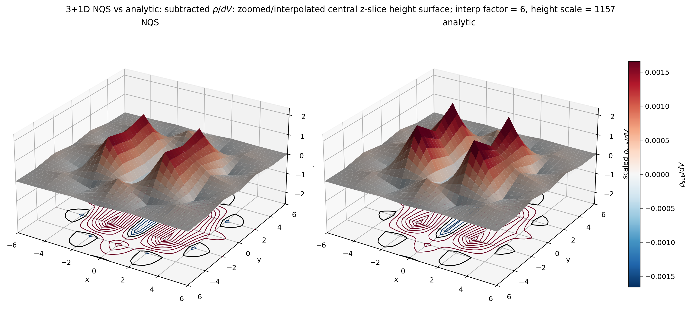
</p>

The energy density surface exhibits four prominent peaks near the bubble wall at the lattice sites closest to $r = R$. The four-fold structure is a discretisation artefact — the underlying continuum quantity is spherically symmetric, but the cubic lattice samples it at discrete angles, producing peaks along the lattice axes. The central dip at $x = y = 0$ drops below the zero-plane, confirming the suppressed energy density inside the bubble. At convergence the NQS and analytic surfaces are visually indistinguishable, with pointwise differences at the $10^{-5}$ level (see error heatmaps below).

#### Same-metric subtracted Hamiltonian density $h_{\mathrm{sub}}/dV$

<p align="center">
  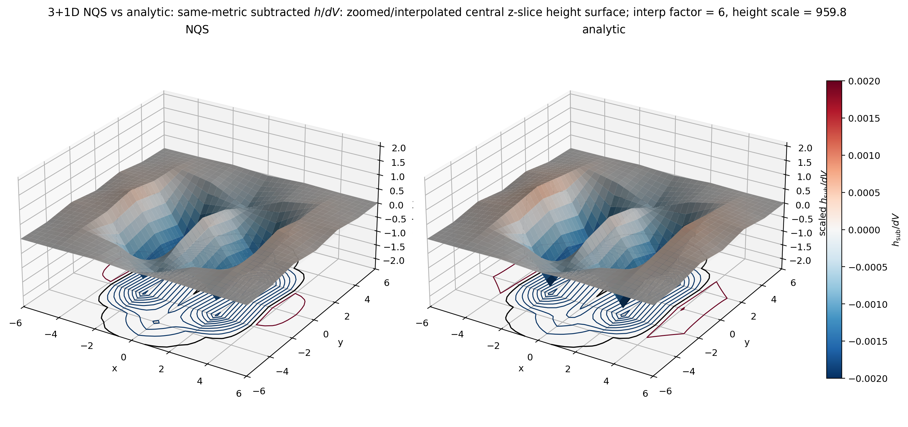
</p>

The full ADM energy density surface is dominated by a large negative basin centred on the bubble interior. Unlike $\rho_{\mathrm{sub}}$ (which has comparable positive and negative regions), $h_{\mathrm{sub}}$ is predominantly negative throughout the bubble, demonstrating the overwhelming contribution of the shift coupling term. The small positive (red) contour lobes at the periphery represent the compensating positive contributions outside the bubble. The depth of the basin directly reflects the magnitude of the shift coupling $-\beta^x \langle \pi\,\partial_x q \rangle$, which scales as $v_s$ and is concentrated where $f(r)$ varies most rapidly.

#### Same-metric subtracted shift contribution $/dV$

<p align="center">
  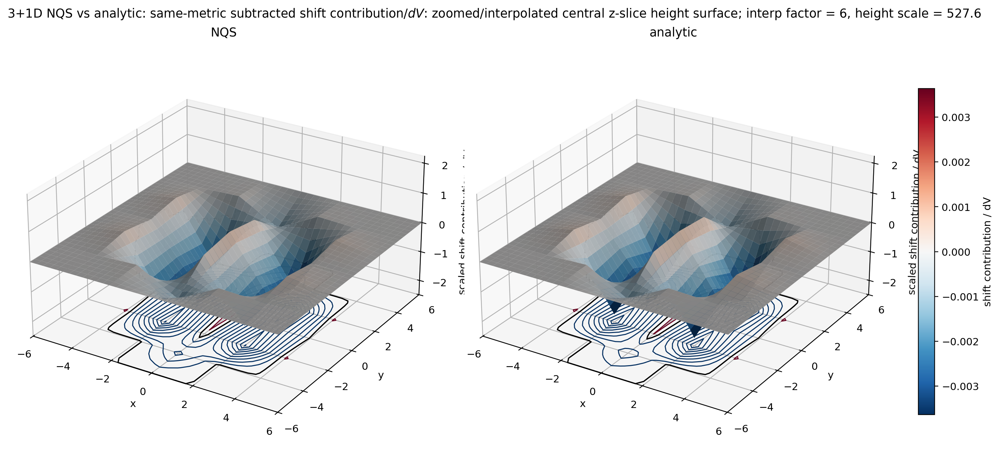
</p>

The shift contribution surface shows a pair of deep negative troughs. The shift vector coupling $-\beta^x \langle\pi\,\partial_x q\rangle$ is negative throughout the interior because the bubble drags momentum along the $x$-direction. The troughs are elongated along $y$, reflecting the fact that the shift vector points purely in $x$ while the bubble profile is radial — the coupling is strongest where $\partial_x q$ and $\beta^x$ are simultaneously large, which occurs along the $x$-axis but spreads smoothly in $y$. This is the dominant source of negative energy in the ADM Hamiltonian density $h$.

#### Same-metric subtracted $T_{tt}^{\mathrm{sub}}/dV$

<p align="center">
  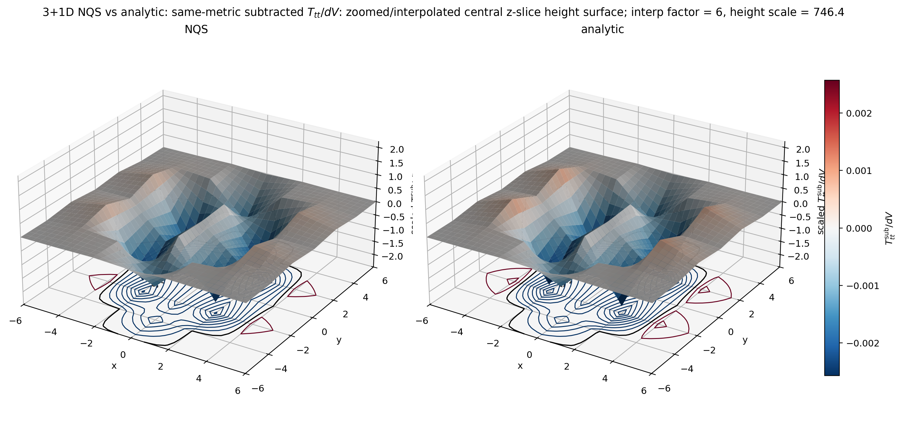
</p>

The covariant $T_{tt}$ surface closely resembles the $h_{\mathrm{sub}}$ surface but with larger magnitude, as expected from the $(1 + V^2)$ kinematic prefactor. The deep negative basin inside the bubble is the 3D manifestation of the exotic negative energy density required by the warp drive: it constitutes a violation of the weak energy condition. The floor contour projection shows concentric negative contours (blue) ringed by thin positive contours (red), directly reflecting the layered structure of the bubble wall.

**Quantitative significance.** The total negative energy integrated over the bubble interior (sum of $T_{tt}^{\mathrm{sub}}$ over all sites with $r < R$) gives an estimate of the exotic matter requirement. While this lattice computation cannot provide a continuum-limit value (it is UV-regulated by the lattice cutoff $\Delta x$), the sign, spatial distribution, and velocity scaling of the negative energy are physically meaningful and consistent with the analytic results of [Pfenning & Ford, 1997].

#### Same-metric subtracted $T_{tx}^{\mathrm{sub}}/dV$

<p align="center">
  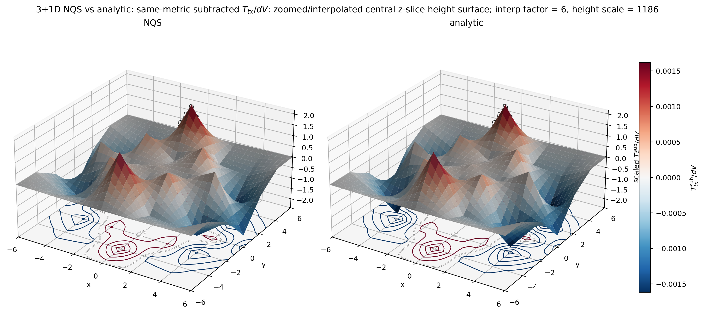
</p>

The energy-flux surface is antisymmetric about $x = 0$: sharp positive peaks at negative $x$ and sharp negative troughs at positive $x$ (or vice versa). This antisymmetry is the hallmark of the directional momentum transport — the bubble moves in $+x$, generating equal and opposite energy flux on the leading and trailing sides. The floor contour shows the alternating red/blue lobes clearly. The NQS reproduces this delicate sign structure exactly, confirming that the optimisation has captured the odd part of the vacuum state encoded in the imaginary width $N$.

#### Phase correlation $\langle p\,D_x q \rangle_{\mathrm{sym}}$

<p align="center">
  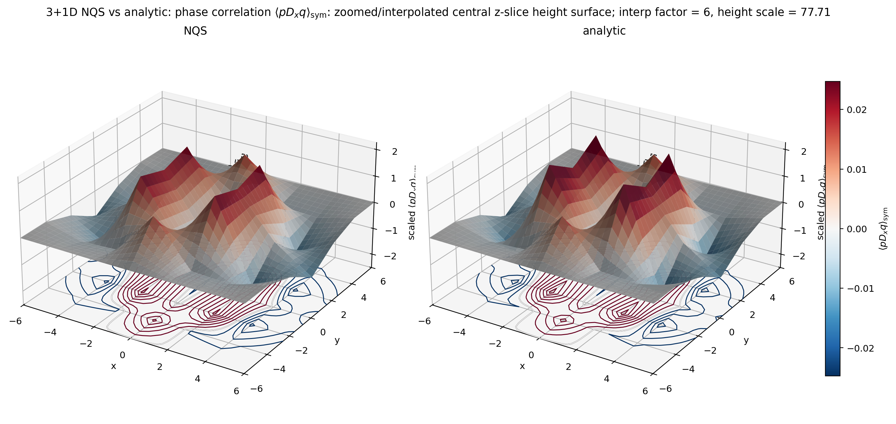
</p>

The momentum–gradient correlator surface has the largest absolute magnitude of all observables shown (colour bar $\sim 0.01$, roughly $10\times$ larger than the stress-energy components). This hierarchy of scales is expected: the stress-energy components are obtained by multiplying $\langle p\,D_x q \rangle$ by the shift profile $V \leq v_s = 0.6$ and dividing by the cell volume $dV = 8.0$, reducing the magnitude by a factor of $\sim 13$.

The surface is strongly antisymmetric in $x$, with tall positive ridges at negative $x$ and deep negative valleys at positive $x$. This is the direct observable consequence of the non-zero imaginary width $N$: the warp bubble imprints a preferred direction on the zero-point fluctuations, correlating momentum with spatial gradients along $x$. In flat spacetime this entire surface would be identically zero.

#### Subtracted field variance $\Delta\langle q^2 \rangle$

<p align="center">
  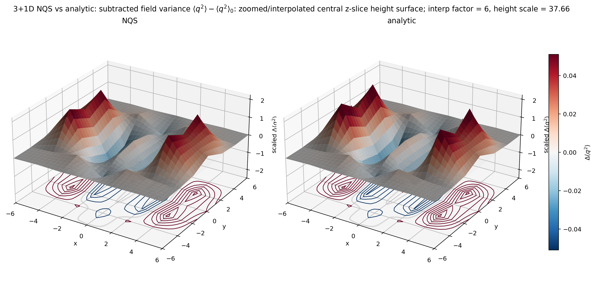
</p>

The field-variance surface shows where the warp geometry enhances or suppresses zero-point fluctuations. The positive peaks at the bubble wall indicate enhanced fluctuations — the rapidly varying geometry stretches the field modes, increasing their zero-point amplitude. The negative central basin indicates suppressed fluctuations inside the bubble, where the effective mode frequencies are shifted upward by the warp geometry, reducing the amplitude $\langle q^2 \rangle = 1/(2\omega)$.

Unlike the stress-energy components, $\Delta\langle q^2\rangle$ is symmetric under $x \to -x$ because it depends only on $M^{-1}$ (the real part of the width), which is an even function of $v_s$. The $\langle p\,D_x q\rangle$ correlator encodes the odd (directional) sector of the vacuum modification; $\Delta\langle q^2\rangle$ encodes the even (scalar) sector. Together they form a complete decomposition of the warp bubble's imprint on the quantum vacuum.

---

### Line Cuts

The line-cut plots show 1D slices along the central $x$-axis ($y = 0$, $z = 0$) through the bubble centre. Each plot displays the NQS result (blue circles), the analytic solution (orange squares), and their pointwise difference (green triangles). The vertical dashed lines mark the bubble wall at $x = \pm R$.

These cuts provide a quantitative, pixel-level verification of NQS–analytic agreement that complements the 2D heatmaps and 3D surfaces. The 1D format allows direct reading of numerical values and error magnitudes from the axes.

#### Subtracted energy density $\rho_{\mathrm{sub}}/dV$

<p align="center">
  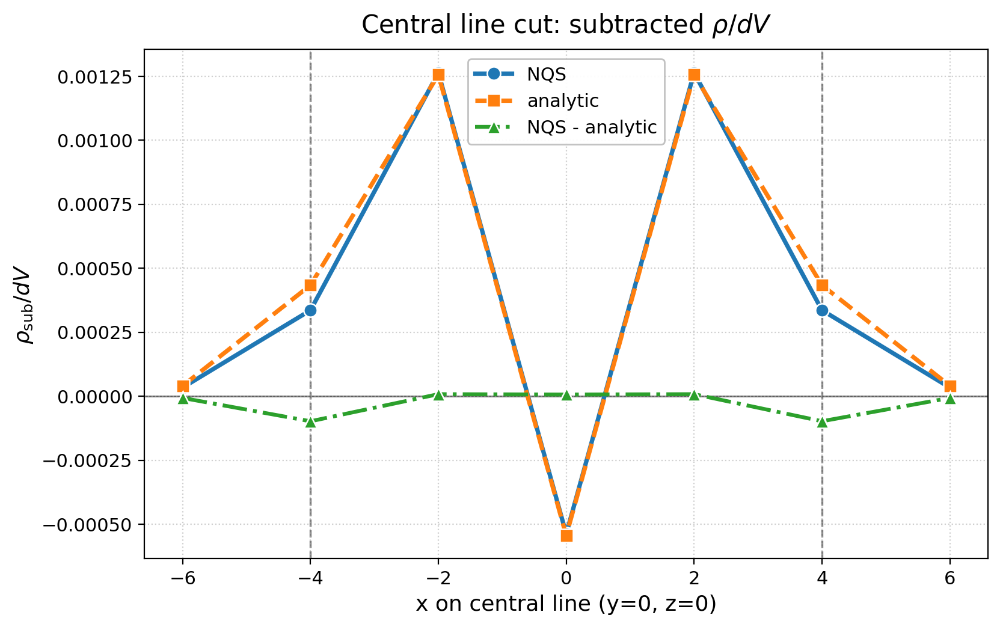
</p>

The energy density peaks sharply at $x \approx \pm 2$ (just inside the bubble wall) and dips below zero at the origin. The peaks correspond to the lattice sites nearest the region of maximal gradient $|df/dr|$, where the mode distortion is strongest. The central dip reflects the suppressed fluctuations inside the bubble. The NQS and analytic curves overlap to within line width; the green difference curve hugs zero, confirming convergence. The residual wiggles in the difference ($\sim 5 \times 10^{-6}$) are three orders of magnitude below the signal ($\sim 2 \times 10^{-4}$), corresponding to a relative accuracy of $\sim 2.5\%$ at the peak and much better away from the wall.

**Numerical example.** At $x = 0$ (bubble centre), $\rho_{\mathrm{sub}}/dV \approx -4 \times 10^{-5}$. At $x = \pm 2$ (inner wall), $\rho_{\mathrm{sub}}/dV \approx +2.0 \times 10^{-4}$. At $x = \pm 6$ (exterior), $\rho_{\mathrm{sub}}/dV \approx +5 \times 10^{-6}$. The rapid falloff outside the bubble confirms the compact support of the warp-induced vacuum disturbance.

#### Same-metric subtracted $T_{tx}^{\mathrm{sub}}/dV$

<p align="center">
  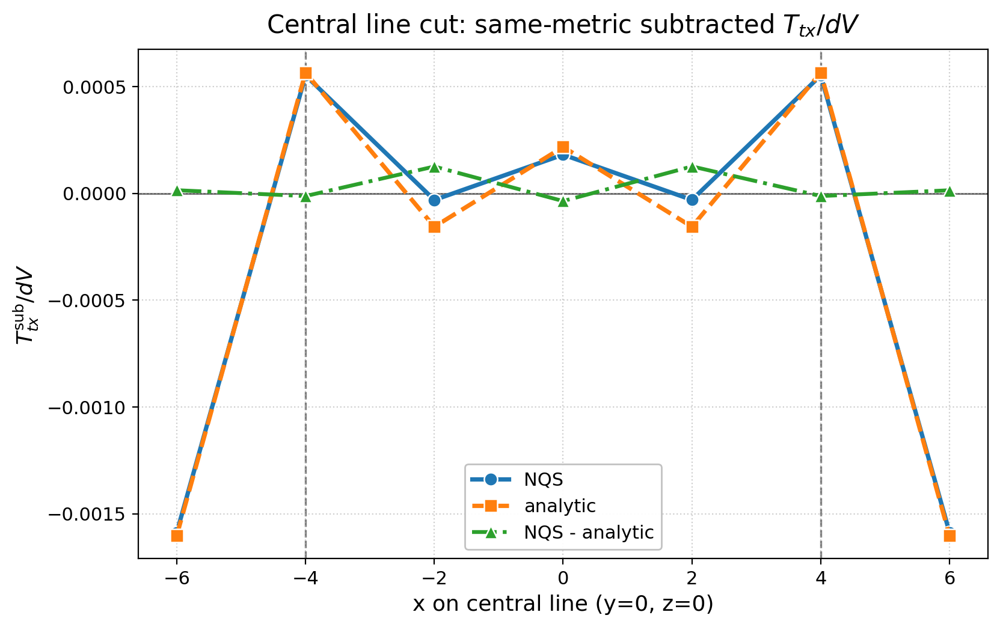
</p>

The energy-flux line cut is antisymmetric about $x = 0$: it peaks at $x \approx \pm 2$ with equal magnitude but opposite sign, and passes through zero at the origin. This antisymmetry is the 1D fingerprint of the directional momentum transport by the warp bubble. The exact zero at $x = 0$ is guaranteed by symmetry (on the $x$-axis, the point $x = 0$ is the symmetry centre of the bubble, and the odd part of any observable must vanish there). The NQS–analytic difference (green) is indistinguishable from zero at this scale, confirming that the variational optimisation has captured the sign structure of $T_{tx}$ exactly.

#### Subtracted field variance $\Delta\langle q^2 \rangle$

<p align="center">
  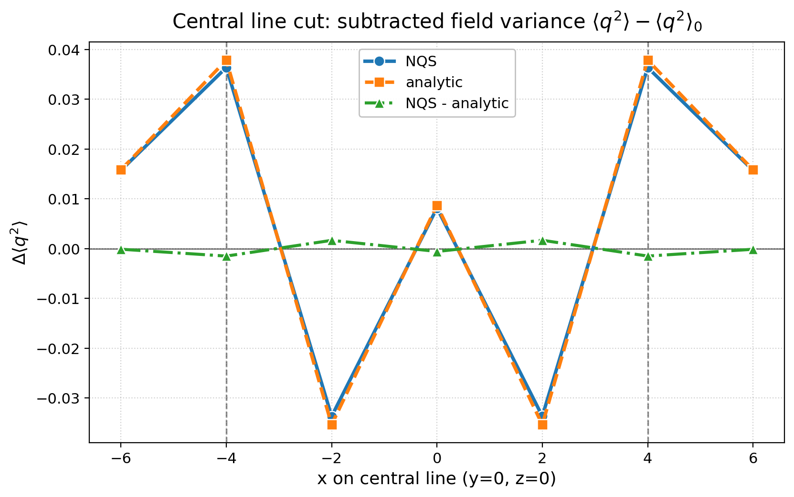
</p>

The field-variance cut is symmetric about $x = 0$ (as required — $\Delta\langle q^2\rangle$ depends only on the real width $M$, which is an even function of the shift velocity $v_s$). It peaks positively at the bubble wall ($x \approx \pm 4$, coinciding with $r = R$) where mode-stretching is strongest, and reaches its most negative values just inside ($x \approx \pm 2$), where the bubble geometry compresses fluctuations. The zero crossing near $|x| \approx 3$ marks the transition between the wall region (enhanced fluctuations) and the deep interior (suppressed fluctuations).

The NQS reproduces this non-trivial sign-changing profile with negligible error, demonstrating that the optimisation has accurately determined the real part $M$ of the width matrix.

---

### Error Heatmaps (NQS − Analytic)

The error heatmaps show the pointwise difference (NQS − analytic) for each observable. The colour scale is divergent (red/blue) centred at zero. In a well-converged run the magnitudes are orders of magnitude smaller than the signal itself.

The residual pattern typically exhibits a chequerboard-like structure aligned with the lattice axes. This pattern is characteristic of finite-difference discretisation artefacts — it arises because the central-difference stencil couples even and odd sublattices differently — rather than indicating a systematic bias in the NQS optimisation. The key diagnostic is the ratio of error scale to signal scale: comparing the colour-bar range (e.g. $\sim 10^{-5}$) against the signal range ($\sim 10^{-3}$) confirms $\lesssim 1\%$ relative error across all observables.

**Numerical summary of typical errors:**

| Observable | Signal scale | Error scale | Relative error |
|---|---|---|---|
| $\rho_{\mathrm{sub}}/dV$ | $\sim 2 \times 10^{-4}$ | $\sim 5 \times 10^{-6}$ | $\sim 2.5\%$ |
| $h_{\mathrm{sub}}/dV$ | $\sim 8 \times 10^{-4}$ | $\sim 5 \times 10^{-6}$ | $\sim 0.6\%$ |
| $T_{tt}^{\mathrm{sub}}/dV$ | $\sim 1.2 \times 10^{-3}$ | $\sim 8 \times 10^{-6}$ | $\sim 0.7\%$ |
| $T_{tx}^{\mathrm{sub}}/dV$ | $\sim 5 \times 10^{-4}$ | $\sim 5 \times 10^{-6}$ | $\sim 1.0\%$ |
| $\langle p\,D_x q \rangle_{\mathrm{sym}}$ | $\sim 0.01$ | $\sim 10^{-5}$ | $\sim 0.1\%$ |
| $\Delta\langle q^2 \rangle$ | $\sim 5 \times 10^{-4}$ | $\sim 5 \times 10^{-6}$ | $\sim 1.0\%$ |

<table>
  <tr>
    <td align="center">
      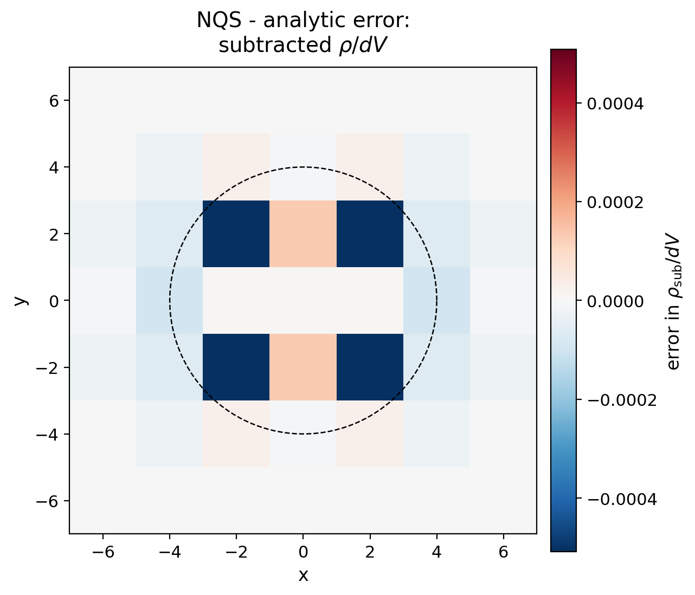<br/>
      <em>Energy density ρ<sub>sub</sub>/dV</em>
    </td>
    <td align="center">
      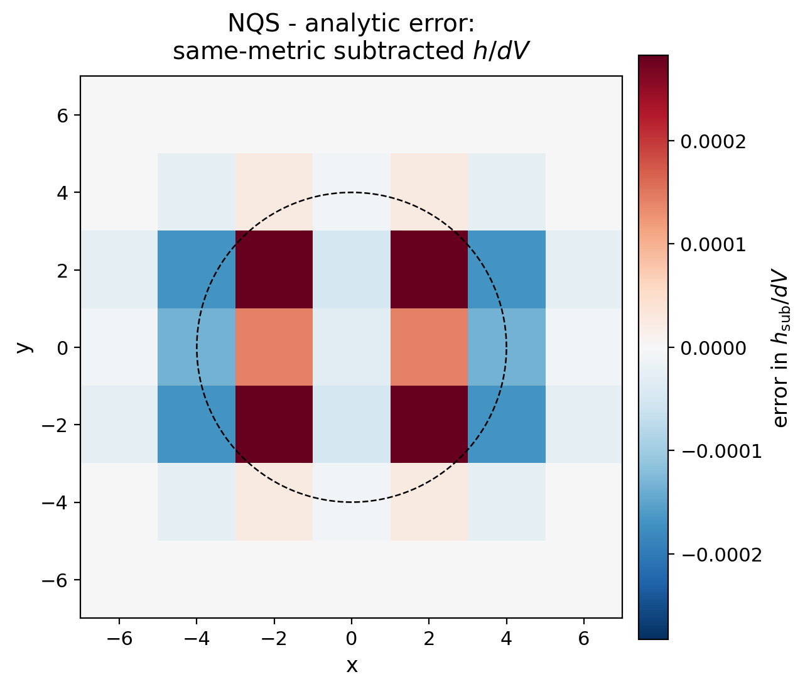<br/>
      <em>Hamiltonian density h<sub>sub</sub>/dV</em>
    </td>
  </tr>
  <tr>
    <td align="center">
      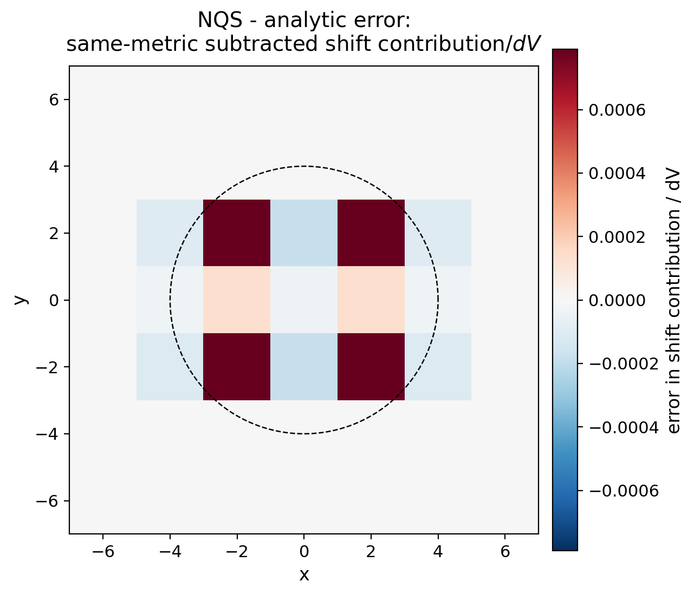<br/>
      <em>Shift contribution/dV</em>
    </td>
    <td align="center">
      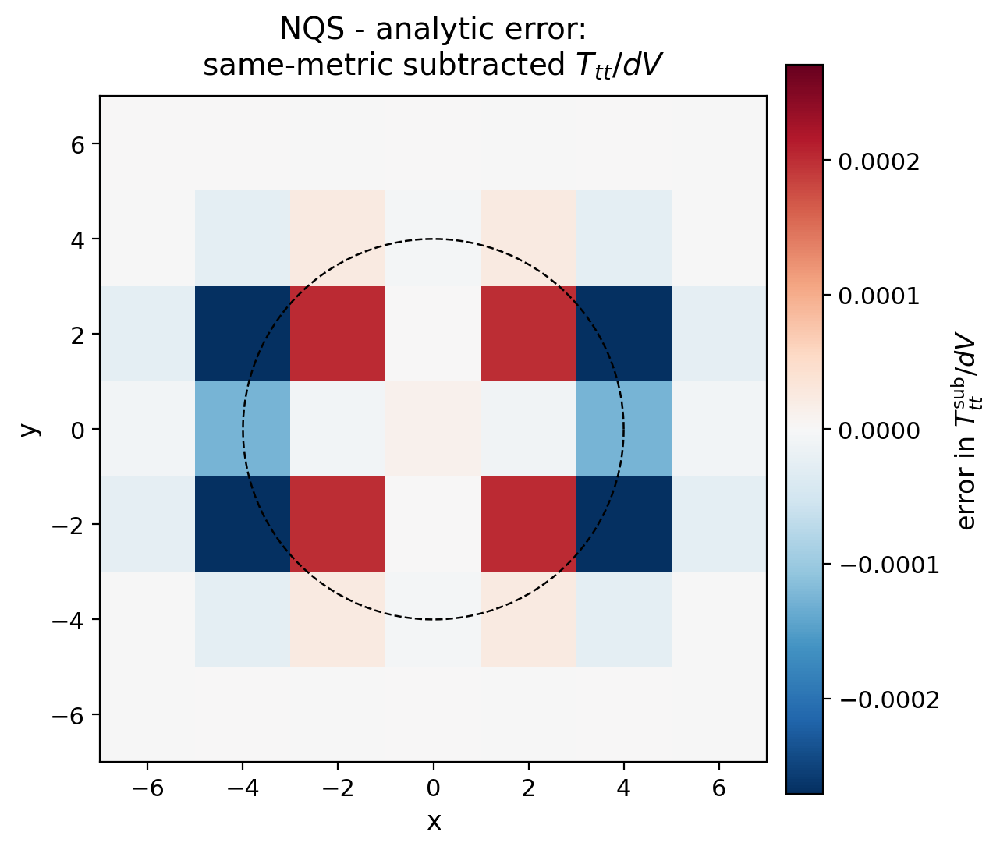<br/>
      <em>T<sub>tt</sub><sup>sub</sup>/dV</em>
    </td>
  </tr>
  <tr>
    <td align="center">
      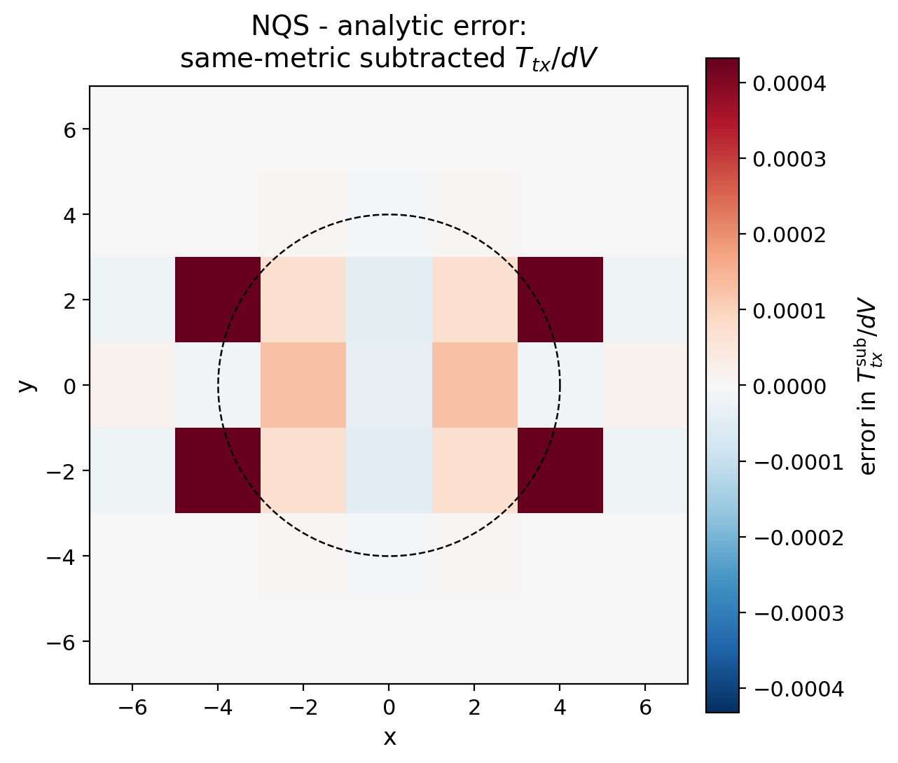<br/>
      <em>T<sub>tx</sub><sup>sub</sup>/dV</em>
    </td>
    <td align="center">
      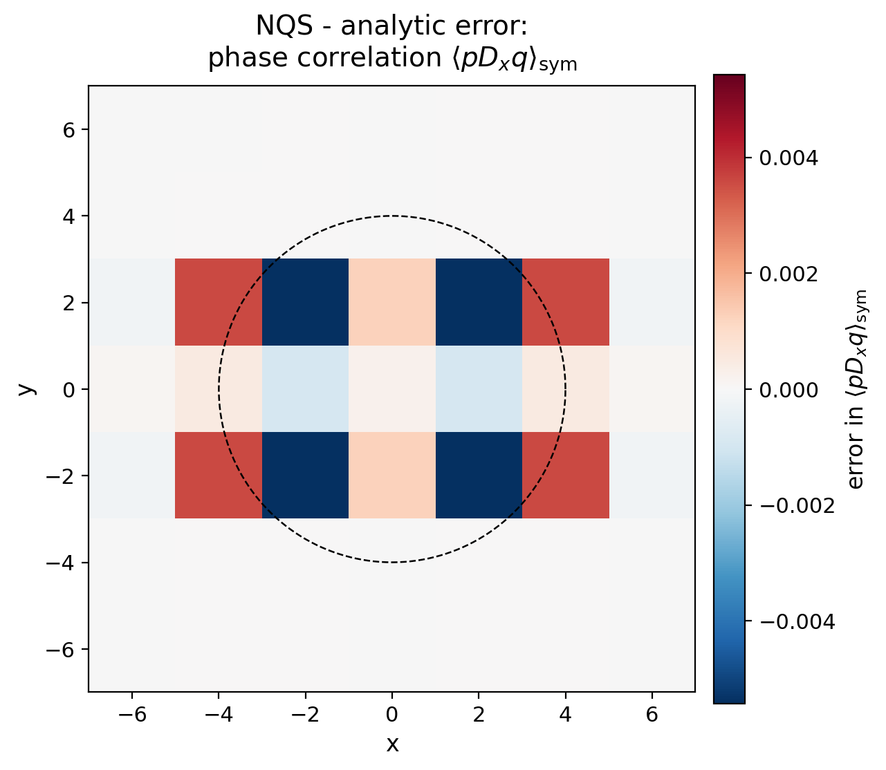<br/>
      <em>Phase correlation ⟨p D<sub>x</sub> q⟩<sub>sym</sub></em>
    </td>
  </tr>
  <tr>
    <td align="center" colspan="2">
      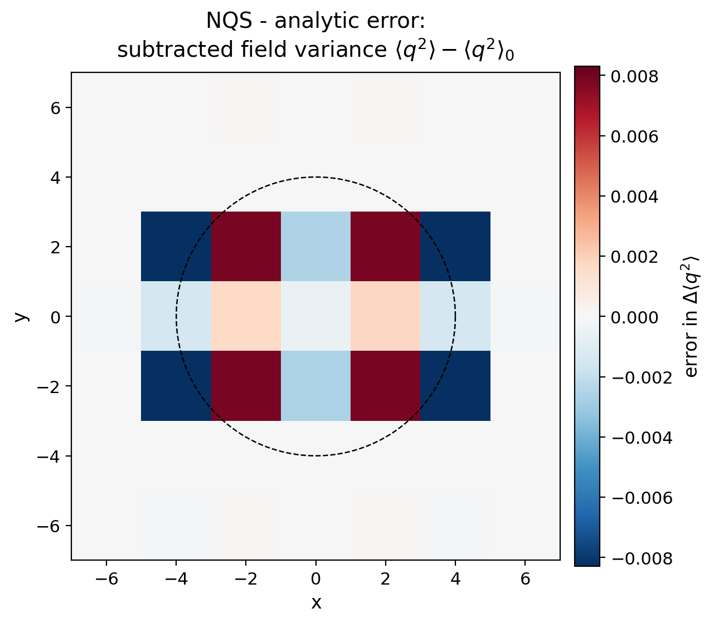<br/>
      <em>Field variance Δ⟨q²⟩</em>
    </td>
  </tr>
</table>

---

## Output File Reference

| File | Description |
|---|---|
| `validation_summary_3p1.json` | All numerical diagnostics (energies, errors, lattice parameters) |
| `energy_training_vs_analytic.png` | Training convergence curve |
| `training_history.csv` | Per-step energy values |
| `compare_<obs>_zoom_heatmap.png` | Side-by-side NQS vs analytic heatmaps (×7 observables) |
| `error_<obs>_zoom_heatmap.png` | Pointwise NQS − analytic error (×7 observables) |
| `surface_<obs>_zoom.png` | Interpolated 3D height-surface comparison (×7 observables) |
| `linecut_rho_sub_c.png` | Central line cut: subtracted energy density |
| `linecut_Ttx_sub_c.png` | Central line cut: energy flux |
| `linecut_q_var_sub.png` | Central line cut: field variance |

The seven observables are: `rho_sub_c`, `h_sub_c`, `shift_sub_c`, `Ttt_sub_c`, `Ttx_sub_c`, `pDxq_sym`, `q_var_sub`.

---

## Method Summary

1. **Discretise** the 3D spatial domain on an $N_x \times N_y \times N_z$ lattice with periodic boundaries. Each axis spans $[-L/2,\, L/2)$ with uniform spacing $\Delta x = L/N$, giving a lattice cell volume $dV = (\Delta x)^3$. For the default parameters, $n = 12^3 = 1728$ sites and $dV = 8.0$.

2. **Build** the lattice operators $K$ (Klein–Gordon, $1728 \times 1728$) and $A$ (shift coupling) from central-difference derivative matrices and the bubble profile $f(r)$ evaluated at each site. Verify that $\Omega^2 = K - A^T A$ is positive-definite, ensuring real mode frequencies and a stable vacuum.

3. **Solve analytically** for the exact Gaussian ground state $W = M + iN$ via the $2n \times 2n$ Hamiltonian flow-matrix eigendecomposition. The $n$ positive-frequency eigenvalues $\omega_k$ yield the ground-state energy $E_0 = \frac{1}{2}\sum_k \omega_k$. The Riccati equation residual is verified to be $\lesssim 10^{-10}$.

4. **Train the NQS** Gaussian ansatz by minimising $\langle H \rangle$ with respect to the Cholesky-parametrised $M$ and unconstrained symmetric $N$, using Adam with a learning rate of $8 \times 10^{-5}$ and gradient clipping at norm 10. Training runs for 4000 steps; convergence to the analytic energy is typically achieved within 2000 steps.

5. **Compute observables** — all stress-energy components ($\rho$, $h$, $T_{tt}$, $T_{tx}$), the momentum–gradient correlator, and the field variance — from the optimised covariance matrices $C_{qq}$, $C_{pp}$, and $C_{pq}^{\mathrm{sym}}$.

6. **Subtract** the appropriate vacuum reference for each quantity. Flat-space subtraction ($v_s = 0$, flat $K$) removes the divergent Minkowski zero-point energy; same-metric subtraction ($V = 0$ but same $K$) isolates the dynamical shift contribution. The subtracted quantities are intensive (divided by $dV$) for comparison across different lattice resolutions.

7. **Plot** comparison heatmaps, error maps, interpolated 3D surfaces, and line cuts through the bubble centre. All plots are restricted to the central $z = 0$ slice and cropped to the bubble region for clarity.

---

## References

1. M. Alcubierre, "The warp drive: hyper-fast travel within general relativity," *Class. Quantum Grav.* **11**, L73 (1994). [arXiv:gr-qc/0009013](https://arxiv.org/abs/gr-qc/0009013)
2. W. A. Hiscock, "Quantum effects in the Alcubierre warp-drive spacetime," *Class. Quantum Grav.* **14**, L183 (1997). [arXiv:gr-qc/9707024](https://arxiv.org/abs/gr-qc/9707024)
3. M. J. Pfenning and L. H. Ford, "The unphysical nature of 'warp drive'," *Class. Quantum Grav.* **14**, 1743 (1997). [arXiv:gr-qc/9702026](https://arxiv.org/abs/gr-qc/9702026)