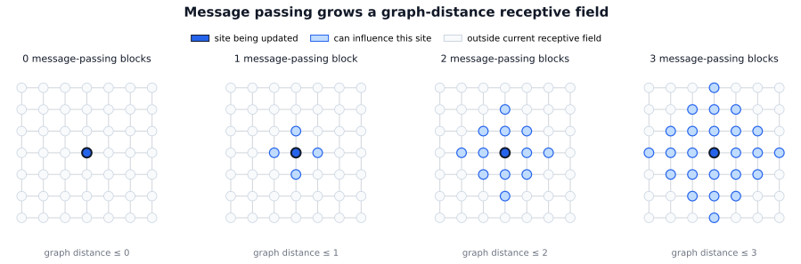
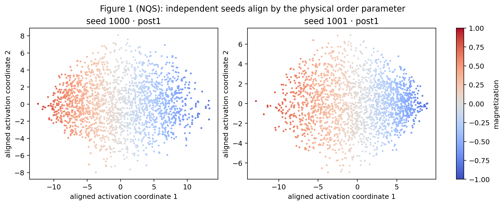
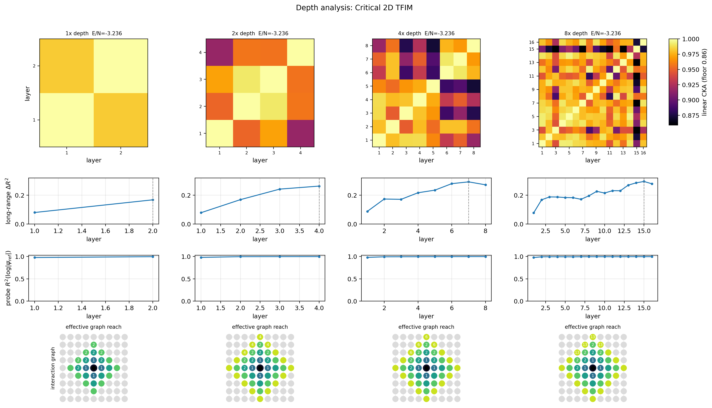
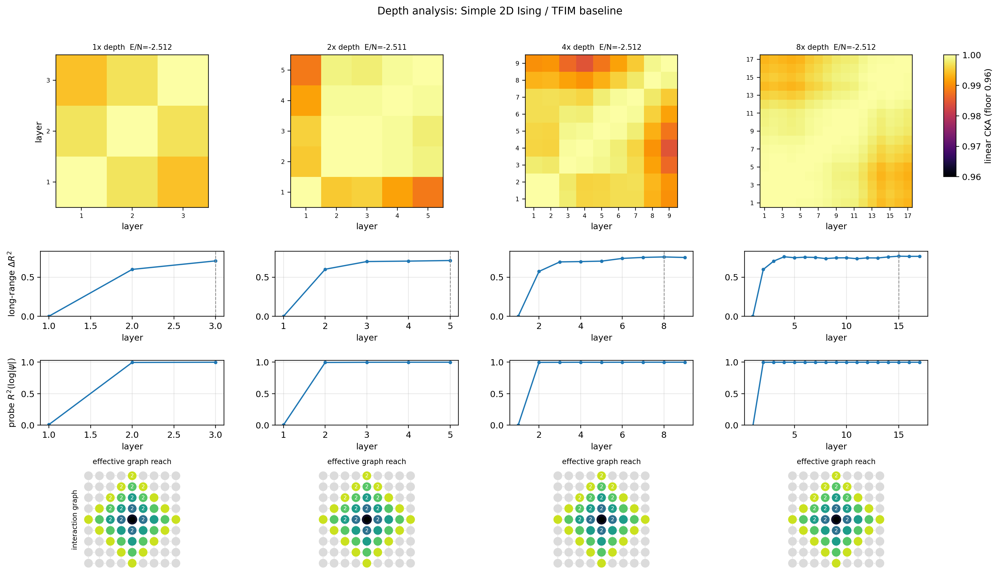
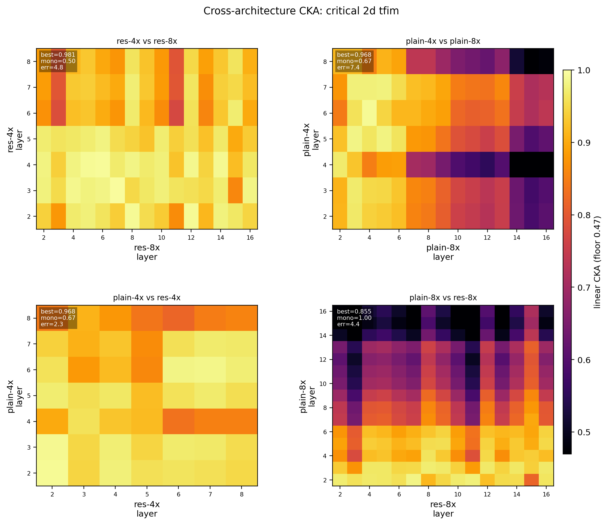
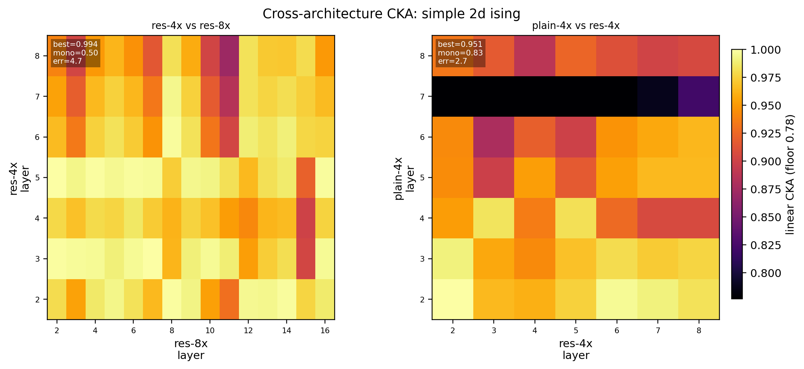

# NQS Representation Universality Analysis — Depth and Residual Connections in Graph Neural Quantum States

> **Hypothesis.** Different NQS (neural quantum state) architectures converge to the same internal representation when learning the ground state of the same Hamiltonian, because they all learn to mirror the Hamiltonian's circuit (interaction-graph) structure.

Hypothesis with a single family of **graph neural quantum states** a local message-passing network on a periodic 2D lattice. The different architectures are obtained by varying two structural knobs while keeping the optimizer, the lattice, and the Hamiltonian fixed:

- **Depth** — a depth multiplier `m ∈ {1, 2, 4, 8}`. Each unit of depth is `blocks_per_unit = 2` message-passing blocks, so the networks have `2m ∈ {2, 4, 8, 16}` blocks.
- **Residual vs plain** — whether each block applies a residual update `h ← h + α·Δ` (`residual = True`) or replaces the representation outright `h ← Δ` (`residual = False`).

Every model parameterizes a real log-amplitude $\log\psi_\theta(\mathbf{s})$ over spin configurations $\mathbf{s} = (s_1, \dots, s_N)$ with $s_i \in \{+1, -1\}$ in the $\sigma^z$-basis, and is trained by variational Monte Carlo with stochastic reconfiguration `VMC_SR` to minimize $\langle H \rangle$. A spin-flip ($\mathbb{Z}_2$) symmetrization is applied to the output so $\psi_\theta(\mathbf{s}) = \psi_\theta(-\mathbf{s})$.

Two Hamiltonians are studied, both transverse-field Ising models on an $L \times L = 8 \times 8$ periodic lattice ($N = 64$ spins):

```math
H = -J \sum_{\langle i,j \rangle} \sigma^z_i \sigma^z_j \; - \; h \sum_i \sigma^x_i \; + \; J_2 \sum_{\langle\langle i,j \rangle\rangle} \sigma^z_i \sigma^z_j
```

- **Critical 2D TFIM** (`critical_2d_tfim`): $J = 1$, $h = 3.044$ near the 2D quantum critical point, $J_2 = 0$. Long-range correlations and the hardest representation-learning regime.
- **Simple 2D Ising / TFIM baseline** (`simple_2d_ising`): a deep-in-a-phase, short-correlation-length baseline where the ground state is essentially product-like and the representation problem is easy.

`⟨i,j⟩` are periodic nearest-neighbor edges; `⟨⟨i,j⟩⟩` are optional 2D diagonal (next-nearest-neighbor) edges, used only when `J2 ≠ 0`. The transverse field $-h\sigma^x$ makes the model stoquastic, so the ground state can be chosen real and non-negative and $\log|\psi|$ is well defined.

Metric analyzation follows [Kornblith et al. 2019](https://arxiv.org/pdf/1905.00414) (CKA).

---

## `GraphNQS`

The network operates directly on the lattice. A spin configuration is reshaped to its lattice shape $(L, L)$ and embedded per site into a feature vector of width `features` (default 16). It is then refined by a stack of message-passing **blocks**, and finally read out to a single scalar log-amplitude.

**Embedding.** Each site spin $s_i$ is mapped to $[s_i, 1]$ and passed through a dense layer + activation (GELU by default) to give node features $h_i^{(0)} \in \mathbb{R}^{F}$.

**Message-passing block $b$.** With pre-norm $\tilde h = \mathrm{LayerNorm}(h)$, the block forms a nearest-neighbor message by averaging over the lattice neighbors (periodic `roll` along each axis),

```math
m_i = \frac{1}{|\mathcal{N}(i)|} \sum_{j \in \mathcal{N}(i)} \tilde h_j,
```

concatenates the local message features $[\tilde h_i,\; m_i,\; \tilde h_i \odot m_i,\; h_i]$ (optionally also 2D diagonal messages when `use_diag_messages` is set), and maps them through a 2-layer MLP to an update $\Delta_i$. A learned sigmoid **gate** and a per-channel **LayerScale** $\alpha$ modulate the update before it is applied:

```math
\Delta_i \leftarrow \mathrm{gate}_i \odot \Delta_i, \qquad
h_i^{(b+1)} =
\begin{cases}
h_i^{(b)} + \alpha \odot \Delta_i & \text{residual} \\[2pt]
\Delta_i & \text{plain.}
\end{cases}
```

`residual = True` is the residual GNN; `residual = False` is the plain GNN. LayerScale is initialized to $1/\sqrt{\text{blocks}}$ so that deep residual stacks start near the identity, and the learning rate / SR diagonal shift are scaled with depth (`lr ∝ m^{-1/2}`, `diag_shift ∝ m^{1/2}`) so deeper models remain trainable.

**Readout.** A final LayerNorm + 2-layer MLP produces one scalar per site; these are summed and divided by $\sqrt{N}$ to give $\log\psi_\theta(\mathbf{s})$.

**Activation names.** The analysis pulls named activations from each forward pass: `embed`, and for each block `pre{b}`, `msg{b}`, `delta{b}`, `gate{b}`, `post{b}`. Within-network CKA uses `post{b}` (block outputs); cross-architecture CKA uses `delta{b}` (block updates); the local probe uses node-resolved activations of the chosen layers.

---

### mechanism: message passing grows a graph-distance receptive field



The central claim behind the hypothesis is structural. In a local message-passing GNN, one block lets every site exchange information with its lattice nearest neighbors. After $b$ blocks, the representation at a site can only depend on spins within **graph distance $b$** — exactly one shell of the interaction graph per block.

The schematic above makes this concrete on a 2D lattice. With $0$ blocks the site sees only itself (graph distance $\le 0$). Each additional message-passing block adds the next Manhattan-distance shell: $\le 1$, then $\le 2$, then $\le 3$, and so on. The "receptive field" of the GNN therefore *is* the ball of the interaction graph, and its radius equals the number of blocks.

This is the precise sense in which the network mirrors the Hamiltonian's circuit structure: the Hamiltonian couples nearest neighbors, and the only way information propagates between distant sites in the network is by hopping along those same edges. If the hypothesis holds, then (i) the network should encode short-range terms first and longer-range terms only at deeper layers, and (ii) two networks of the same depth should reach the same correlations at the same relative layer, even if one is residual and the other plain. The probes in Figure 3 measure exactly this shell-by-shell growth, and the receptive-field picture is the prediction they are tested against.

---

## Figure 1 — Independent seeds align by the physical order parameter



**What it measures.** Whether two independently initialized and independently trained models develop the *same* low-dimensional activation geometry, and whether that geometry is organized by a physical quantity. This is the NQS analogue of Figure 1 in [Kornblith et al. 2019](https://arxiv.org/pdf/1905.00414), where the leading principal components of two differently initialized image networks are shown to agree.

Two residual GNNs of the same depth (`depth_multiplier = 1`, layer `post1`) are trained from different random seeds (`seed 1000` and `seed 1001`) on the critical 2D TFIM and evaluated on the **same** probe configurations $\mathbf{s}^{(1)}, \dots, \mathbf{s}^{(M)} \sim |\psi(\mathbf{s})|^2$.

Procedure:

1. Collect the layer-`post1` activations of each model on the shared probe samples and flatten them per sample into rows:

```math
H_A =
\begin{bmatrix}
h_A(\mathbf{s}^{(1)}) \\ \vdots \\ h_A(\mathbf{s}^{(M)})
\end{bmatrix},
\qquad
H_B =
\begin{bmatrix}
h_B(\mathbf{s}^{(1)}) \\ \vdots \\ h_B(\mathbf{s}^{(M)})
\end{bmatrix}.
```

2. Center each matrix and take its first two principal components by SVD, $H = U\Sigma V^\top$, keeping the top-2 scores $T = U_{:,1:2}\,\Sigma_{1:2}$.

3. Because PCA is only defined up to an orthogonal transformation, align seed $B$'s scores to seed $A$'s with the optimal rotation (orthogonal Procrustes). With $M = V U^\top$ from the SVD of $T_B^\top T_A$, set $T_B \leftarrow T_B M$.

4. Color each point by the configuration's magnetization $m(\mathbf{s}) = \frac{1}{N}\sum_i s_i$.

**Numerical example.** For a 6-spin sample $\mathbf{s} = (+1,-1,+1,+1,-1,+1)$ the magnetization is $m = \frac{1}{6}(1-1+1+1-1+1) = \tfrac{1}{3} \approx 0.33$, a mildly "up" configuration that maps to a faint-red point.

**Results.** Both seeds produce the same picture: a single dominant axis, with magnetization varying smoothly from strongly positive (red) on one side to strongly negative (blue) on the other and the disordered $m \approx 0$ configurations in the middle. After the rotational alignment the two clouds are essentially the same shape. The leading activation coordinates of independently trained NQS therefore encode the **physical order parameter**, not an initialization-specific artifact.

**Verdict.** Strong support at the level of the dominant representation: independent seeds discover the same leading geometry, and that geometry is the order parameter the Hamiltonian cares about.

---

## Figure 3 — Depth analysis (critical 2D TFIM) and the simple-Ising baseline





The first image is the critical TFIM (`make_figure3`, `min_distance = 3`); the second is the simple-Ising baseline (`make_figure4`, which calls the same routine with `min_distance = 2`). Each column is one depth multiplier (`1x, 2x, 4x, 8x`), and the title of each column reports the trained energy per site $E/N$. Each column stacks four panels.

### Row 1 — within-network layer CKA

**What it measures.** Linear CKA between every pair of the network's own block-output activations (`post{b}`), evaluated on the shared probe samples. This shows how much each block transforms the representation relative to the others, and whether deep stacks become **redundant** (many layers collapsing to the same representation), the pathology Kornblith et al. use CKA to detect in Figure 3 of their paper.

For two centered activation matrices $X \in \mathbb{R}^{n\times p}$ and $Y \in \mathbb{R}^{n\times q}$ collected on the same $n$ samples, linear CKA is

```math
\mathrm{CKA}(X,Y) = \frac{\lVert Y^\top X\rVert_F^2}{\lVert X^\top X\rVert_F\,\lVert Y^\top Y\rVert_F}.
```

It is invariant to isotropic scaling and to orthogonal transformations of the features, equals 1 when the two representations span the same subspace, and 0 when their kernels are orthogonal. (The heatmaps use a per-figure color floor — the 2nd percentile of the CKA values, clipped at 0.96 — so that the small differences between near-identical layers remain visible; this is purely a display choice.)

**Numerical example.** If $Y^\top X = \begin{bmatrix} 3 & 1 \\ 0 & 2 \end{bmatrix}$ then $\lVert Y^\top X\rVert_F^2 = 9+1+0+4 = 14$; with $\lVert X^\top X\rVert_F = 4.0$ and $\lVert Y^\top Y\rVert_F = 3.7$, $\mathrm{CKA} = 14/(4.0 \times 3.7) \approx 0.95$.

**Results.**

- **Simple baseline.** CKA is uniformly high (note the floor of 0.96): every block produces nearly the same representation. With an essentially product-like ground state there is little for successive blocks to add, so depth is mostly redundant — the layers all sit near the last one. A faint off-diagonal cooling appears only at `8x`, where a handful of late blocks drift slightly.
- **Critical TFIM.** A clear block structure appears and sharpens with depth. At `1x`–`2x` the few blocks are all very similar (CKA $\gtrsim 0.95$). By `4x`–`8x` the matrix develops distinct near-diagonal bands with cooler off-diagonal regions (CKA dipping toward $0.86$): adjacent blocks stay similar but distant blocks become genuinely different representations. Unlike the pathological 8x CNN in Kornblith et al., the deep critical-TFIM GNN does **not** collapse most of its layers onto the final one — successive blocks keep doing distinct work, consistent with the longer correlation length giving each additional shell something to encode.

### Row 2 — long-range $\Delta R^2$ probe

**What it measures.** Whether each layer adds *new long-range* correlation information beyond a trivial local baseline. For every distance shell $r$ on the periodic lattice, a target correlator is built for each site,

```math
y_{a,i,r} = s_a(i)\cdot \mathrm{mean}_{j:\,d(i,j)=r} s_a(j),
```

where $d(i,j)$ is the periodic Manhattan graph distance. A ridge-regression probe predicts $y_{\cdot,\cdot,r}$ first from a **baseline** of cheap local features — the site spin $s_a(i)$, its nearest-neighbor average, and the global magnetization $m(\mathbf{s}_a)$ — and then from the baseline **plus** the node activations of layer $\ell$. The extra explanatory power of the layer is

```math
\Delta R^2(\ell, r) = \max\!\big(0,\; R^2(\text{baseline} + h^{(\ell)} \to y_r) - R^2(\text{baseline} \to y_r)\big),
```

with $R^2 = 1 - \sum_k (y_k - \hat y_k)^2 / \sum_k (y_k - \bar y)^2$ computed on a held-out test split (the ridge penalty is selected on a separate validation split). The curve plotted is the per-layer mean of $\Delta R^2$ over the **long-range** shells only ($r \ge 3$ for the critical TFIM, $r \ge 2$ for the simple baseline). The dashed vertical line marks the layer of maximum long-range $\Delta R^2$.

**Numerical example.** On a 1D ring, for shell $r=1$ and sample $(+1,-1,+1,+1)$, site 0 has neighbors at sites 3 and 1, i.e. spins $(+1,-1)$, whose mean is $0$, so $y_{0,1} = (+1)\cdot 0 = 0$. The probe asks whether a layer's activations let you predict these products better than the local baseline already can.

**Results.** In both problems the curve rises steeply over the first one or two blocks and then plateaus: the network acquires its long-range decoding ability early and refines it slowly thereafter. The plateau level is markedly higher for the simple baseline ($\Delta R^2 \approx 0.7$–$0.8$) than for the critical TFIM ($\Delta R^2 \approx 0.2$–$0.3$), because critical long-range correlations are genuinely harder to capture linearly. As depth increases the maximizing layer (dashed line) moves to later blocks, matching the receptive-field picture: a longer stack can keep adding longer-range information for more layers before saturating.

### Row 3 — $\log|\psi|$ readout probe

**What it measures.** How well each full-layer activation linearly predicts the target log-amplitude. When the system is small enough for exact diagonalization the target is the exact $\log|\psi(\mathbf{s})|$; otherwise it is the log-amplitude of the lowest-energy trained model used as a reference (the panel's $y$-axis label switches to $\log|\psi_{\text{ref}}|$ accordingly). For each layer the activations are flattened per sample and a ridge probe predicts the single scalar per configuration, scored by held-out $R^2$.

**Results.** The probe $R^2$ saturates almost immediately — at $\approx 1.0$ from the very first block onward in essentially every column of both problems. The information needed to reconstruct the (log) wavefunction amplitude is present and linearly accessible from the earliest layers; the later blocks reorganize that information (as Row 1 shows) rather than create the ability to express the amplitude. In other words, depth is spent on *correlation structure*, not on *being able to write down $\log|\psi|$*.

### Row 4 — effective graph reach (interaction graph)

**What it measures.** A compact summary of the long-range probe as a picture of the interaction graph. For each shell $r$, the probe records the **first layer** whose $\Delta R^2$ crosses the threshold (`probe_r2_threshold = 0.35`). The diagram colors each lattice site at graph distance $r$ from the center by that first-reaching layer, and overlays the layer index on the reached shells. Gray sites were never decoded above threshold; the black center is the site itself.

**Results.** The colored region is the part of the interaction graph the network has effectively learned to reach. For the simple baseline the central shells light up almost entirely at layer 2, mirroring its quick saturation. For the critical TFIM the reach grows outward shell by shell, and the layer labels increase with distance — the inner shells are reached at layer 2, outer shells only at substantially later layers (labels climb into double digits at `8x`). This is the receptive-field-growth schematic recovered from data: each additional shell of the Hamiltonian graph is unlocked by going deeper, exactly as message passing predicts.

**Verdict (Figure 3).** Strong support for the mechanism. Across depths and across both Hamiltonians, the networks (i) make $\log|\psi|$ linearly available immediately, (ii) acquire long-range correlation information progressively with depth, and (iii) reach successive graph-distance shells at successively later layers, matching the message-passing receptive field. The critical TFIM uses its depth non-redundantly; the simple baseline saturates early and leaves deep layers nearly idle.

---

## Figure 5 — Cross-architecture CKA





**What it measures.** This is the direct test of the hypothesis: do *different* architectures, trained separately on the *same* Hamiltonian, build the *same* layer-by-layer representation? For each pair of networks, linear CKA is computed between **every** block-update activation (`delta{b}`, first block dropped) of one network and every block-update of the other, on the shared probe samples:

```math
\mathrm{CKA}(X,Y) = \frac{\lVert Y^\top X\rVert_F^2}{\lVert X^\top X\rVert_F\,\lVert Y^\top Y\rVert_F},
```

producing a rectangular layer×layer similarity matrix (rows = first network's layers, columns = second network's layers). The four panels compare residual vs plain GNNs and shallower vs deeper versions of each:

- **res-4x vs res-8x** — same architecture (residual), different depth.
- **plain-4x vs plain-8x** — same architecture (plain), different depth.
- **plain-4x vs res-4x** — different architecture (plain vs residual), same depth.
- **plain-8x vs res-8x** — different architecture, same (deeper) depth.

Here `4x` has 8 blocks and `8x` has 16 blocks; the first block is dropped, so res-4x shows 7 layers, res-8x 15 layers, and so on. As in Kornblith et al.'s cross-architecture experiment (their Figure 5), the question is whether the deeper network's new layers are *inserted between* the shallower network's layers — which would show up as a continuous bright ridge running from the bottom-left to the top-right of the matrix.

**Summary statistics.** Each panel is annotated with three numbers computed from the similarity matrix $S$ (rows indexed by $i$, columns by $j$):

- **`best`** — the mean over rows of the best match in that row, $\frac{1}{R}\sum_i \max_j S_{ij}$. How well, on average, each layer of network A finds *some* aligned layer in network B. Near 1 means strong layerwise correspondence.
- **`mono`** — monotonicity of the best-match index, the fraction of consecutive rows whose argmax does not move backwards, $\frac{1}{R-1}\sum_i \mathbb{1}[\,\arg\max_j S_{i+1,j} \ge \arg\max_j S_{i,j}\,]$. Near 1 means the correspondence is order-preserving — layer $k$ of A maps to a layer of B no earlier than where layer $k-1$ mapped, i.e. the two networks process information in the same sequence.
- **`err`** — root-mean-square deviation of the best-match index from the ideal diagonal that linearly maps A's layers onto B's. Small `err` means the correspondence not only preserves order but lies close to a clean proportional alignment.

(The color floor is the 3rd percentile of all values in the figure, clipped at 0.97, again only for contrast.)

**Numerical example.** If a 4-row matrix has best-match columns $(1, 2, 2, 4)$ against an ideal diagonal $(1, 2, 3, 4)$, then `mono` $= 1.0$ (the indices never decrease) and `err` $= \sqrt{\tfrac14(0 + 0 + 1 + 0)} = 0.5$.

**Results — critical 2D TFIM.**

- **res-4x vs res-8x** (`best = 0.981`, `mono = 0.50`, `err = 4.8`): warmest panel. Two residual networks of different depth are highly similar layer-for-layer, with a broad bright band — the deeper network largely reuses the shallower one's representations and interleaves extra refinement, consistent with "new layers inserted between old layers."
- **plain-4x vs res-4x** (`best = 0.968`, `mono = 0.67`, `err = 2.3`): the cleanest correspondence in the figure. At equal depth, the plain and residual GNNs build closely matching representations layer by layer (low `err`), which is the headline result — *changing the architecture (residual ↔ plain) at fixed depth barely changes the layerwise representation*.
- **plain-4x vs plain-8x** (`best = 0.968`, `mono = 0.67`, `err = 7.4`): plain networks of different depth still correspond, but less tightly than the residual pair; the larger `err` reflects that without residual connections the layer alignment between depths is looser and the deepest plain layers (top-right) cool noticeably.
- **plain-8x vs res-8x** (`best = 0.855`, `mono = 1.00`, `err = 4.4`): the **deep** cross-architecture pair is the hardest case. Overall similarity drops (`best = 0.855`) and the matrix is visibly cooler, but the correspondence is perfectly order-preserving (`mono = 1.00`): the two 16-block networks still process information in the same sequence even though their absolute representations have drifted apart. Plain depth-16 partly degrades (the early/late layers diverge most), which is exactly where the absence of residual connections is expected to hurt trainability.

**Results — simple 2D Ising.** Only two pairs are produced for the baseline.

- **res-4x vs res-8x** (`best = 0.994`, `mono = 0.50`, `err = 4.7`): near-perfect cross-depth similarity. With a product-like target every layer is essentially the same simple representation, so depth matching is trivial.
- **plain-4x vs res-4x** (`best = 0.951`, `mono = 0.83`, `err = 2.7`): strong same-depth cross-architecture correspondence, with one conspicuous exception — the plain-4x layer-7 row is dark across all res-4x columns. That single plain layer learned an idiosyncratic representation that does not align with anything in the residual network, a localized failure of universality rather than a global one.

**Verdict (Figure 5).** Support for the hypothesis, strongest at moderate depth. At equal depth, residual and plain GNNs converge to closely corresponding layerwise representations (low `err`, high `best`), and residual networks match across depths almost perfectly. The hypothesis weakens in the deep, no-residual regime: at 16 blocks the plain↔residual similarity drops, though the *ordering* of representations stays universal (`mono = 1.00`). The cleanest evidence is that swapping the architecture at fixed depth changes the representation far less than changing the depth does.

---

## Synthesis

| Metric | Level tested | Result | Verdict |
|---|---|---|---|
| PCA seed alignment (Fig 1) | Dominant activation geometry | Independent seeds share the leading geometry, organized by magnetization | ✅ Strong universality |
| Within-network layer CKA (Fig 3, row 1) | Internal processing / redundancy | Simple baseline near-redundant; critical TFIM uses depth non-redundantly, no layer collapse | 📊 Architecture/phase-dependent |
| Long-range $\Delta R^2$ probe (Fig 3, row 2) | Correlation range vs depth | Long-range info acquired early, refined with depth; max layer moves deeper as depth grows | ✅ Matches receptive-field growth |
| $\log\lvert\psi\rvert$ probe (Fig 3, row 3) | Amplitude expressibility | $R^2 \approx 1$ from the first block in all models | ✅ Universal and immediate |
| Effective graph reach (Fig 3, row 4) | Hamiltonian-graph coverage | Shells reached at successively later layers; recovers message-passing prediction | ✅ Strong support for mechanism |
| Cross-architecture CKA (Fig 5) | Layerwise representation match | Tight at equal depth (plain↔res `err` 2.3–2.7); residual matches across depth; deep plain↔res weaker but order-preserving | ⚠️ Strong at moderate depth, weaker deep/plain |

---
## Reproducing

```bash
python -m nqs_cka.cli --config config.yml # train (or load from cache) and render all figures
python -m nqs_cka.cli.plot_main --config config.yml # re-render figures from cached runs only
```

Key knobs (`config.py`): `analysis.depth_multipliers = (1, 2, 4, 8)`, `analysis.blocks_per_unit = 2`, `model.residual`, `analysis.probe_r2_threshold = 0.35`, and the per-problem `physics` entries (`critical_2d_tfim` at $h = 3.044$, `simple_2d_ising` baseline). Figure 5's architecture list and pairs (`res-4x`, `res-8x`, `plain-4x`, `plain-8x`) are set in the `figures.figure5` config section.

## Reference

- S. Kornblith, M. Norouzi, H. Lee, G. Hinton. *Similarity of Neural Network Representations Revisited.* ICML 2019. [arXiv:1905.00414](https://arxiv.org/pdf/1905.00414)