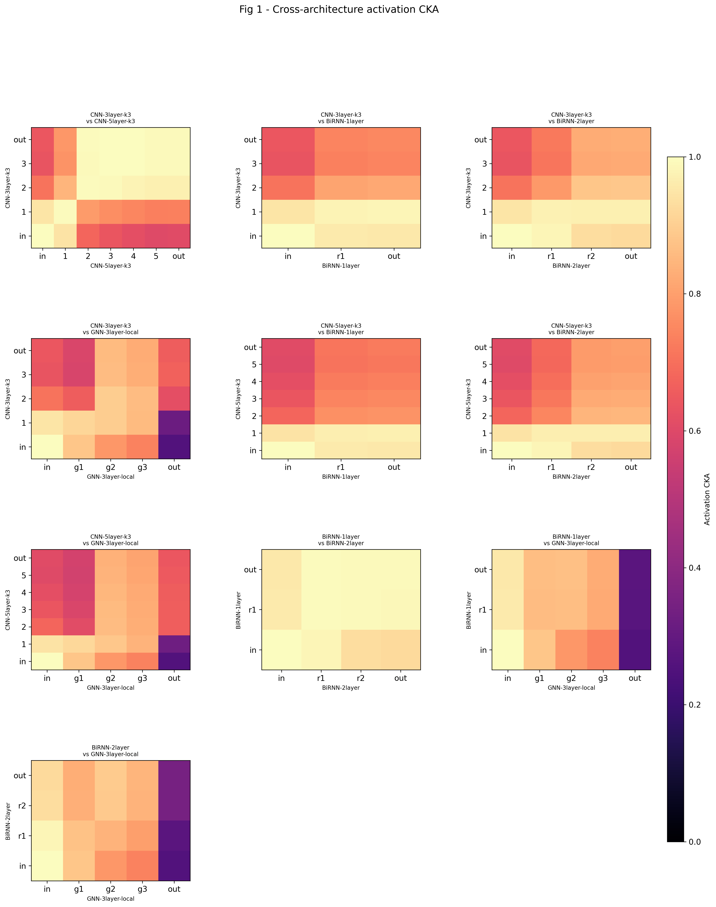
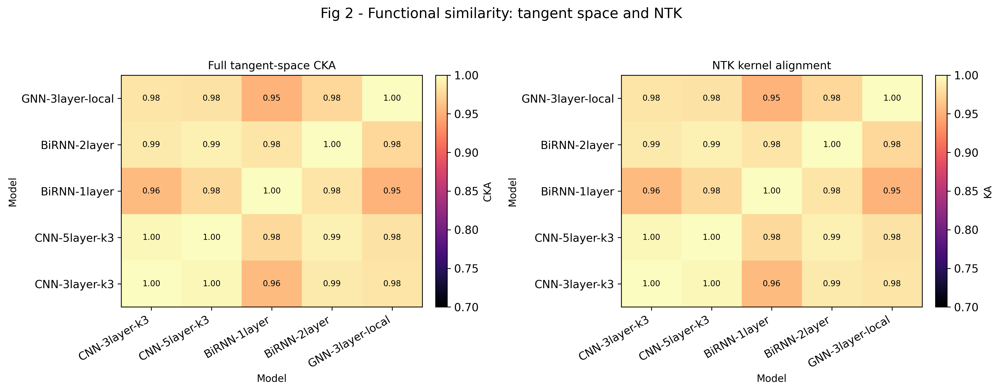
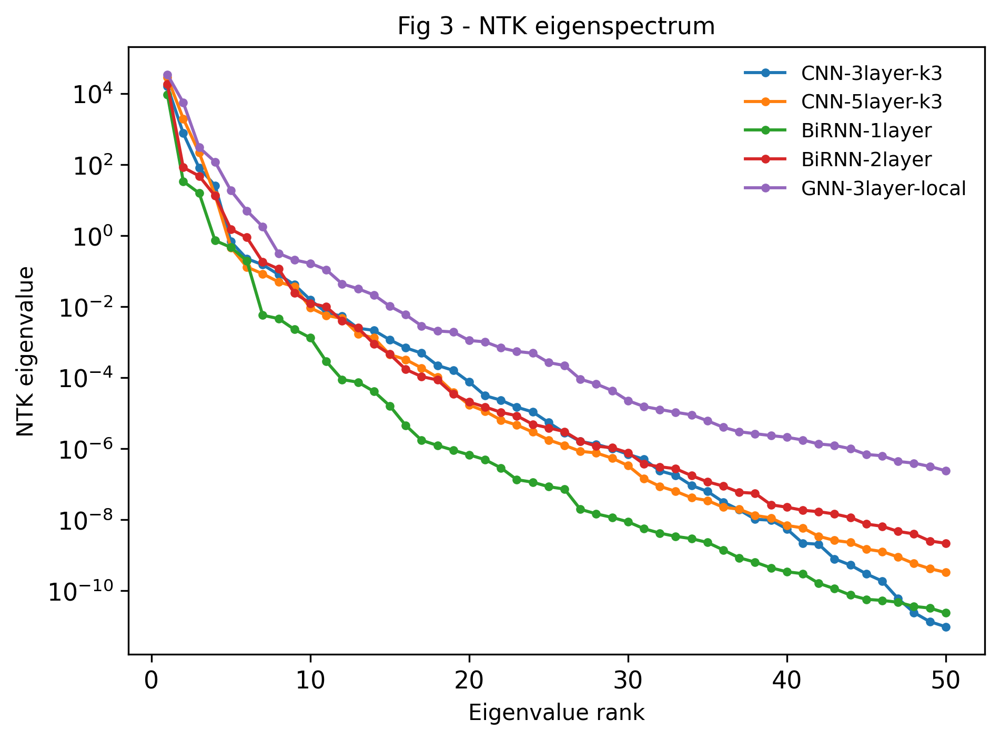
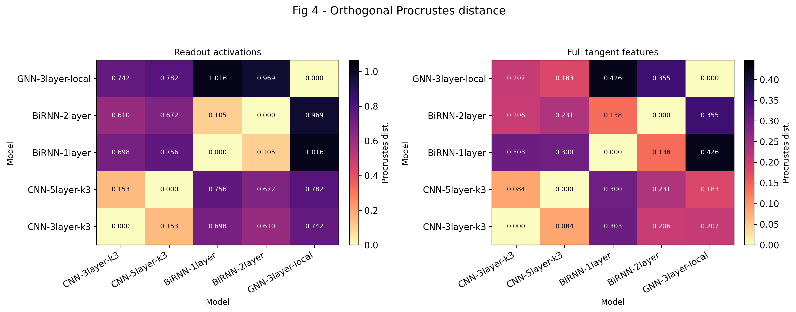
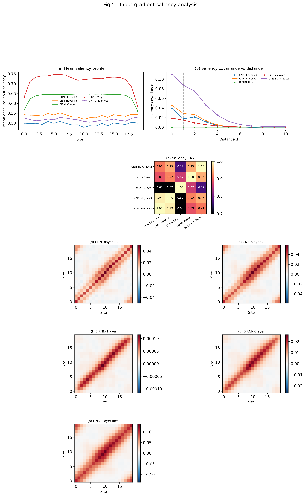
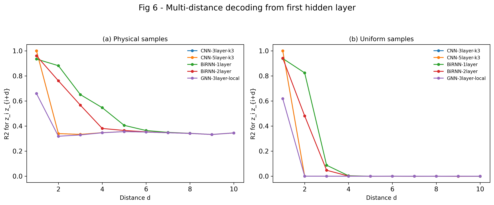
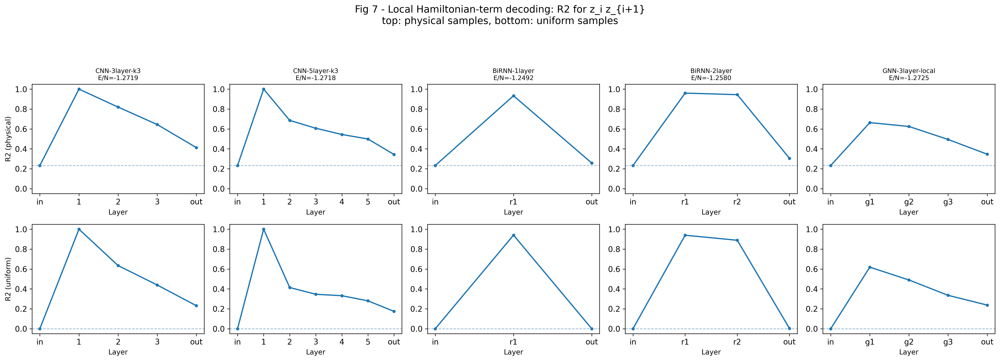
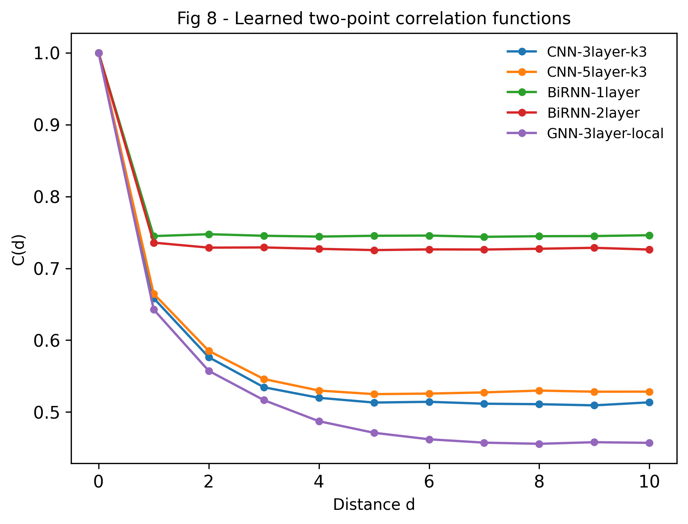
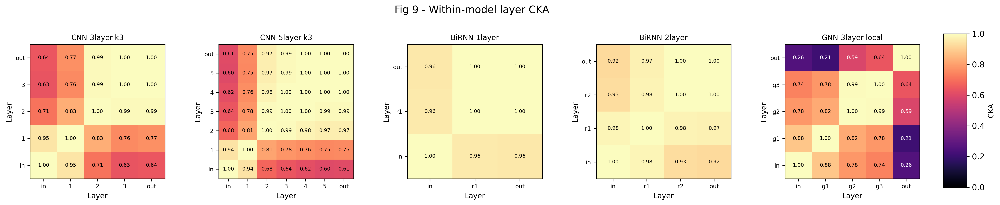
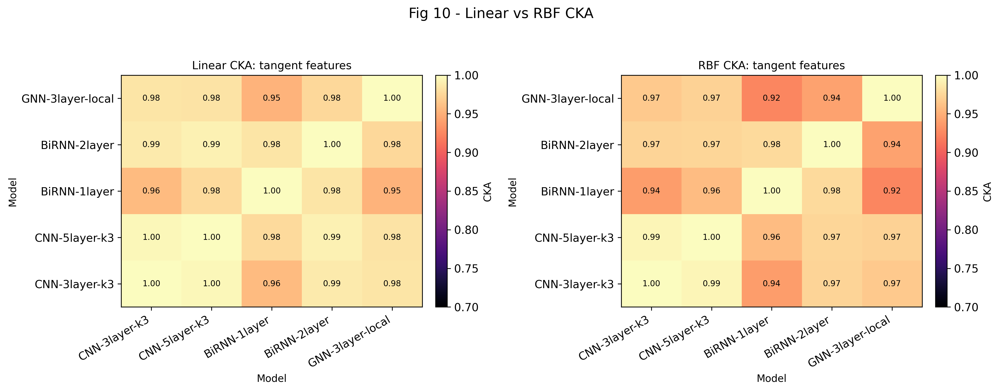

# NQS Representation Universality Analysis

> Different NQS neural-network architectures converge to the same internal representation when learning the ground state of the same Hamiltonian, because they all learn to mirror the Hamiltonian's circuit structure.

In the first version, two CNNs, two bidirectional RNNs, and one local-message-passing GNN are tested on the 1D TIFM at the critical point $h/J = 1$ with $N=20$ spins and periodic boundary conditions:

```math
H = -J \sum_{\langle i,j \rangle} \sigma^z_i \sigma^z_j - h \sum_i \sigma^x_i
```

All models parameterize $\log \psi_\theta(\mathbf{s})$ and are trained with VMC to minimize $\langle H \rangle$, where $\mathbf{s}=(s_1,\dots,s_N)$ denotes a spin configuration in the $\sigma^z$-basis with $s_i\in\{+1,-1\}$.

---

All five models converge to comparable ground-state energies. The two CNNs reach $E/N \approx -1.272$, the BiRNNs land at $E/N \approx -1.249$ to $-1.258$, and GNN-3layer-local achieves $E/N \approx -1.273$. All models approximate the same ground state.

---

## Figure 1 - Cross-architecture activation CKA



**What it measures.** Linear Centered Kernel Alignment (CKA, [Kornblith et al. 2019](https://arxiv.org/pdf/1905.00414)) between the hidden-layer activations of every pair of models evaluated on the same set of spin configurations drawn from $|\psi|^2$.

All models parameterize $\log \psi_\theta(\mathbf{s})$ and are evaluated on the **same spin configurations** $\mathbf{s}=(s_1,\dots,s_N)$, with $s_i\in\{+1,-1\}$.

Procedure:

1. Draw configurations from the Born distribution:

```math
\mathbf{s}^{(1)}, \dots, \mathbf{s}^{(M)} \sim |\psi(\mathbf{s})|^2.
```

For example, for a 6-spin system:

```math
\mathbf{s}^{(1)} = (+1,-1,+1,+1,-1,+1),
\qquad
\mathbf{s}^{(2)} = (-1,-1,+1,-1,+1,+1).
```

2. Feed the **same samples** into two models, for example Model A = CNN and Model B = RNN.

3. Suppose the RNN processes spins sequentially $s_1 \to s_2 \to s_3 \to \cdots \to s_N$. The hidden state evolves as:

```math
h_t = f(h_{t-1}, s_t),
```

where $s_t$ is the input spin at step $t$, $h_t$ is the hidden activation, and $f$ is the recurrent update.

4. Example forward pass. For the input configuration

```math
\mathbf{s}^{(1)} = (+1,-1,+1,+1,-1,+1),
```

the RNN computes:

```math
h_1 = f(h_0,+1), \qquad h_2 = f(h_1,-1), \qquad h_3 = f(h_2,+1), \dots
```

Suppose the hidden dimension is 3. The activations might become:

```math
h_1 =
\begin{bmatrix}
0.2\\
-0.1\\
0.7
\end{bmatrix},
\qquad
h_2 =
\begin{bmatrix}
0.5\\
0.3\\
-0.2
\end{bmatrix},
\qquad
h_3 =
\begin{bmatrix}
0.9\\
0.1\\
0.4
\end{bmatrix}.
```

These vectors are the **hidden-layer activations**. They encode information about previous spins, correlations, entanglement structure, and related features.

5. Build activation matrices. For Model A and Model B, each row corresponds to the hidden representation of one sampled spin configuration:

```math
H_A =
\begin{bmatrix}
h_A(\mathbf{s}^{(1)}) \\
h_A(\mathbf{s}^{(2)}) \\
\vdots \\
h_A(\mathbf{s}^{(M)})
\end{bmatrix},
\qquad
H_B =
\begin{bmatrix}
h_B(\mathbf{s}^{(1)}) \\
h_B(\mathbf{s}^{(2)}) \\
\vdots \\
h_B(\mathbf{s}^{(M)})
\end{bmatrix}.
```

6. Compute linear CKA. Linear CKA compares the similarity between the two representation matrices:

```math
\mathrm{CKA}(H_A,H_B)
=
\frac{\|H_A^\top H_B\|_F^2}{\|H_A^\top H_A\|_F\,\|H_B^\top H_B\|_F}.
```

A high CKA value means that the two models organize spin configurations similarly, learn similar many-body correlations, and have aligned internal representations.

---

CKA measures **representation similarity**, not just final energy accuracy. In general, given two centered activation matrices $X \in \mathbb{R}^{n \times p}$ and $Y \in \mathbb{R}^{n \times q}$:

```math
\mathrm{CKA}(X,Y)=\frac{\|Y^\top X\|_F^2}{\|X^\top X\|_F\,\|Y^\top Y\|_F}.
```

CKA is invariant to isotropic scaling. Suppose all activations are multiplied by a constant, $\tilde H = 5H$. Then every neuron output becomes 5 times larger, for example:

```math
h =
\begin{bmatrix}
1\\
2\\
3
\end{bmatrix}
\quad\to\quad
\tilde h =
\begin{bmatrix}
5\\
10\\
15
\end{bmatrix}.
```

The representation is fundamentally the same; only the scale changed. CKA gives the same similarity score, so CKA ignores global magnitude differences:

```math
\mathrm{CKA}(H_A,H_B)=\mathrm{CKA}(5H_A,H_B).
```

It equals 1 when $X$ and $Y$ span the same column space and 0 when they induce orthogonal kernel matrices.

**Numerical example.** Suppose $X$ and $Y$ are $4 \times 2$ centered matrices. The numerator is $\|Y^\top X\|_F^2$: compute the $2 \times 2$ product $Y^\top X$, square each entry, and sum. If

```math
Y^\top X =
\begin{bmatrix}
3 & 1\\
0 & 2
\end{bmatrix},
```

then $\|Y^\top X\|_F^2 = 9+1+0+4 = 14$. The denominator is $\|X^\top X\|_F \cdot \|Y^\top Y\|_F$. If these equal 4.0 and 3.7, then:

```math
\mathrm{CKA}=\frac{14}{4.0\times3.7}\approx0.95.
```

**Results.** The activation CKA reveals a clear split between *functional convergence at the output* and *architectural divergence at early layers*:

- **Within-family CNN pairs** (CNN-3layer-k3 vs CNN-5layer-k3): warm throughout, with CKA $\gtrsim 0.6$ even between early layers. The same kernel size produces similar intermediate features regardless of depth.
- **CNN↔BiRNN pairs**: uniformly high CKA $(\gtrsim 0.7)$ across all layer pairs. CNN intermediate layers align well with the BiRNN hidden layers, suggesting that the hidden representations share substantial structure even across architecture families.
- **CNN↔GNN pairs**: the input layers of both architectures show near-zero CKA due to different embedding strategies, but the hidden and output layers recover to CKA $\approx 0.6$–$0.8$. The GNN's output layer aligns poorly with CNN layer 1, with CKA $\approx 0.2$–$0.3$, reflecting architectural divergence in how information is routed to the final readout.
- **BiRNN↔GNN pairs**: BiRNN hidden layers show moderate CKA $(\approx 0.5$–$0.7)$ with GNN hidden layers, but the GNN output layer again stands out with very low CKA relative to BiRNN input layers. The BiRNN-1layer ↔ GNN-3layer-local pair shows particularly low CKA at the input-to-output cross $(\approx 0.1)$, reflecting that the GNN's message-passing output compresses information very differently from the BiRNN's sequential readout.
- **BiRNN↔BiRNN**: high CKA at corresponding depths. The input layer of BiRNN-1layer shows near-zero CKA with deeper layers of BiRNN-2layer, reflecting that the raw input encoding has not yet been processed.

**Verdict:** Activation-level universality is **moderate**. Within CNN and BiRNN families, representations are highly similar. Cross-family pairs, especially CNN↔BiRNN, maintain moderate-to-high CKA. The GNN introduces the largest activation-level divergence, particularly at early and output layers, despite strong tangent-space convergence in Figure 2.

---

## Figure 2 - Full tangent-space CKA and NTK kernel alignment



**What it measures.** Two model-by-model similarity matrices computed from the full variational tangent vectors. These metrics compare models using their **variational tangent vectors**

```math
J(\mathbf{s}) = \frac{\partial \log \psi_\theta(\mathbf{s})}{\partial \theta}
```

instead of hidden activations. For each sampled spin configuration $\mathbf{s}$, the tangent vector measures how the wavefunction changes if the model parameters are infinitesimally perturbed. Thus, these methods compare the **local geometry of the variational manifold** learned by different neural quantum states.

Procedure:

1. Draw configurations from the Born distribution:

```math
\mathbf{s}^{(1)},\dots,\mathbf{s}^{(M)} \sim |\psi(\mathbf{s})|^2.
```

2. Feed the same samples into two models.

3. For each sampled configuration $\mathbf{s}^{(i)}$, compute the variational tangent vector:

```math
J(\mathbf{s}^{(i)}) = \frac{\partial \log \psi_\theta(\mathbf{s}^{(i)})}{\partial \theta}.
```

Here, $\theta$ denotes all trainable parameters, and $J(\mathbf{s})$ is the gradient of the wavefunction log-amplitude with respect to those parameters.

4. Concrete RNN example. Suppose the RNN outputs $\log \psi_\theta(\mathbf{s}) = f_\theta(\mathbf{s})$ for the sampled configuration $\mathbf{s}^{(1)}=(+1,-1,+1,+1,-1,+1)$. Assume the RNN has 3 trainable parameters, $\theta=(\theta_1,\theta_2,\theta_3)$. After backpropagation, the tangent vector may be:

```math
J(\mathbf{s}^{(1)})=
\begin{bmatrix}
0.8\\
-0.2\\
0.5
\end{bmatrix}.
```

This means that increasing $\theta_1$ strongly increases $\log\psi$, $\theta_2$ decreases it, and $\theta_3$ moderately increases it.

5. Build tangent matrices. For Model A and Model B, each row corresponds to one sampled spin configuration and each column corresponds to one trainable parameter:

```math
J_A =
\begin{bmatrix}
J_A(\mathbf{s}^{(1)}) \\
J_A(\mathbf{s}^{(2)}) \\
\vdots \\
J_A(\mathbf{s}^{(M)})
\end{bmatrix}
\in \mathbb{R}^{n\times d_A},
\qquad
J_B =
\begin{bmatrix}
J_B(\mathbf{s}^{(1)}) \\
J_B(\mathbf{s}^{(2)}) \\
\vdots \\
J_B(\mathbf{s}^{(M)})
\end{bmatrix}
\in \mathbb{R}^{n\times d_B}.
```

6. Compute tangent-space CKA:

```math
\mathrm{CKA}(J_A,J_B)
=
\frac{\|J_B^\top J_A\|_F^2}{\|J_A^\top J_A\|_F\,\|J_B^\top J_B\|_F}.
```

A high tangent-space CKA means the two models respond similarly to parameter perturbations, span similar variational subspaces, and induce similar local wavefunction deformations.

7. Construct the Neural Tangent Kernel (NTK):

```math
K_A = J_AJ_A^\top,
\qquad
K_B = J_BJ_B^\top.
```

The entry

```math
(K_A)_{ij}=J_A(\mathbf{s}^{(i)})^\top J_A(\mathbf{s}^{(j)})
```

measures how similarly the model responds to two spin configurations.

8. Center the kernels:

```math
\tilde K = H K H,
\qquad
H = I - \frac1n\mathbf{1}\mathbf{1}^\top.
```

9. Compute kernel alignment:

```math
\mathrm{KA}(K_A,K_B)
=
\frac{\mathrm{tr}(\tilde K_A \tilde K_B)}{\sqrt{\mathrm{tr}(\tilde K_A^2)\,\mathrm{tr}(\tilde K_B^2)}}.
```

A high kernel alignment means the two models induce similar similarity structure over configuration space, optimization updates couple configurations similarly, and the models possess similar learning geometry.

**Numerical example.** For tangent-space CKA, suppose $J_A$ and $J_B$ are tangent matrices built from the same $n=3$ sampled spin configurations, with $J_A,J_B\in\mathbb{R}^{3\times2}$. If

```math
J_B^\top J_A =
\begin{bmatrix}
3 & 1\\
0 & 2
\end{bmatrix},
```

then:

```math
\|J_B^\top J_A\|_F^2 = 3^2+1^2+0^2+2^2=14.
```

If $\|J_A^\top J_A\|_F=4.0$ and $\|J_B^\top J_B\|_F=3.7$, then:

```math
\mathrm{CKA}(J_A,J_B)=\frac{14}{4.0\times3.7}\approx0.95.
```

This indicates that the two models have highly similar tangent-space geometry.

For NTK kernel alignment, build $K_A=J_AJ_A^\top\in\mathbb{R}^{n\times n}$, then compute centered kernel alignment as above.

**Results.** This is the strongest evidence **for** the hypothesis. Both panels are nearly identical, and all entries are remarkably high:

- **CNN-3layer-k3 ↔ CNN-5layer-k3:** 1.00, essentially the same variational manifold despite different depths.
- **CNN ↔ BiRNN pairs:** 0.96–0.99. Even across architecture families, the tangent spaces are highly aligned.
- **CNN ↔ GNN-3layer-local:** 0.98. The GNN tangent space aligns as well with the CNNs as the BiRNNs do.
- **BiRNN ↔ GNN-3layer-local:** 0.95–0.98. The lowest value, 0.95, occurs for BiRNN-1layer ↔ GNN-3layer-local.
- **Minimum:** BiRNN-1layer ↔ GNN-3layer-local at 0.95, still very high.

The tangent vector $\partial \log \psi / \partial \theta$ determines how the wavefunction changes when parameters are perturbed. High tangent CKA means that the set of accessible directions of variation spans essentially the same functional subspace in Hilbert space. The models have converged to the same region of the variational manifold, just parameterized through different coordinate systems.

**Verdict:** Functional-level universality is **strong**. The hypothesis holds decisively at the tangent-space level across all three architecture families.

---

## Figure 3 - NTK eigenspectrum



**What it measures.** The eigenvalue spectrum of each model's neural tangent kernel:

```math
K = JJ^\top.
```

The eigenvalues $\lambda_1 \geq \lambda_2 \geq \ldots$ determine the effective dimensionality of the learned kernel. The $k$-th eigenvalue measures how much the model's output varies along the $k$-th principal direction in configuration space.

Procedure:

1. Draw configurations from the Born distribution:

```math
\mathbf{s}^{(1)},\dots,\mathbf{s}^{(M)} \sim |\psi(\mathbf{s})|^2.
```

2. Feed the same sampled spin configurations into a model.

3. For each sampled configuration, compute the variational tangent vector:

```math
J(\mathbf{s}^{(i)}) = \frac{\partial \log \psi_\theta(\mathbf{s}^{(i)})}{\partial \theta}.
```

4. Build the tangent matrix:

```math
J =
\begin{bmatrix}
J(\mathbf{s}^{(1)}) \\
J(\mathbf{s}^{(2)}) \\
\vdots \\
J(\mathbf{s}^{(M)})
\end{bmatrix}
\in \mathbb{R}^{n\times d}.
```

5. Construct the NTK:

```math
K = JJ^\top \in \mathbb{R}^{n\times n},
\qquad
K_{ij}=J(\mathbf{s}^{(i)})^\top J(\mathbf{s}^{(j)}).
```

6. Compute the eigenvalue decomposition:

```math
K = U\Lambda U^\top,
\qquad
\Lambda = \mathrm{diag}(\lambda_1,\lambda_2,\ldots,\lambda_n),
\qquad
\lambda_1 \geq \lambda_2 \geq \cdots.
```

Large leading eigenvalues indicate dominant collective deformation modes of the wavefunction.

**Numerical example.** Suppose:

```math
K = JJ^\top =
\begin{bmatrix}
2 & 1 & 0\\
1 & 3 & 1\\
0 & 1 & 2
\end{bmatrix}.
```

The eigenvalues are $\lambda_1=4$, $\lambda_2=2$, and $\lambda_3=1$. The total kernel variance is:

```math
\sum_i \lambda_i = 4+2+1=7.
```

The explained fractions are:

```math
\frac{\lambda_1}{\sum_i\lambda_i}=\frac47\approx0.57,
\qquad
\frac{\lambda_2}{\sum_i\lambda_i}=\frac27\approx0.29,
\qquad
\frac{\lambda_3}{\sum_i\lambda_i}=\frac17\approx0.14.
```

Most variation is concentrated in the first principal kernel direction, suggesting that the model's tangent space is relatively low-dimensional.

**Results.** The spectra show good agreement at the top and clear architecture-dependent tails:

- **Top 3–5 eigenvalues:** All five models agree closely $(\lambda_1 \approx 10^4)$. The dominant directions of variation are universal.
- **Ranks 5–15:** The spectra begin to separate. CNN-3layer-k3 and CNN-5layer-k3 track each other closely. BiRNN-2layer has a slightly flatter decay.
- **GNN-3layer-local:** Shows a distinctly flatter spectral tail than the CNNs and BiRNN-2layer. Its eigenvalues remain above $10^{-7}$ out to rank 50, about 1–2 orders of magnitude above the CNN tails at the same rank. This indicates that the GNN distributes representational capacity more broadly across configuration-space modes.
- **BiRNN-1layer:** Shows a strikingly steep drop at rank $\approx5$, falling more than 4 orders below the other models by rank 10. This indicates that the single-layer BiRNN concentrates representational capacity in very few modes.

**Interpretation.** The high tangent CKA in Figure 2 is driven by the top eigenvalues, which are shared. The spectral tails differ: the models agree on *what matters most* but disagree on the fine structure. The BiRNN-1layer's rapid spectral decay suggests a very low-dimensional but effective parameterization, whereas the GNN's flat tail suggests a higher effective dimensionality.

**Verdict:** Partial support. The dominant effective kernel is universal; the tail structure is architecture-dependent.

---

## Figure 4 - Orthogonal Procrustes distance



**What it measures.** A stricter test than CKA. After centering and normalizing, find the orthogonal rotation $R$ that best aligns the two representations, then measure the residual:

```math
d_{\mathrm{Proc}}(X,Y)
=
\min_{R^\top R=I}
\left\|
\frac{X}{\|X\|_F}R
-
\frac{Y}{\|Y\|_F}
\right\|_F.
```

CKA is invariant to any invertible linear transform; Procrustes is invariant only to orthogonal transforms. Therefore, $d_{\mathrm{Proc}}=0$ means the representations are geometrically identical up to rotation, while $\mathrm{CKA}=1$ only means they span the same subspace. Procrustes is therefore a stricter notion of representational similarity ([Ding et al. 2023](https://arxiv.org/pdf/2305.06329)).

Procedure:

1. Draw configurations from the Born distribution:

```math
\mathbf{s}^{(1)},\dots,\mathbf{s}^{(M)}\sim |\psi(\mathbf{s})|^2.
```

2. Feed the same sampled spin configurations into two models.

3. Extract hidden-layer activations from both models:

```math
X=
\begin{bmatrix}
x(\mathbf{s}^{(1)})\\
x(\mathbf{s}^{(2)})\\
\vdots\\
x(\mathbf{s}^{(M)})
\end{bmatrix}
\in\mathbb{R}^{n\times p},
\qquad
Y=
\begin{bmatrix}
y(\mathbf{s}^{(1)})\\
y(\mathbf{s}^{(2)})\\
\vdots\\
y(\mathbf{s}^{(M)})
\end{bmatrix}
\in\mathbb{R}^{n\times q}.
```

4. Center the representations:

```math
X_c = HX,
\qquad
Y_c = HY,
\qquad
H = I-\frac1n\mathbf{1}\mathbf{1}^\top.
```

5. Normalize the centered matrices:

```math
\hat X = \frac{X_c}{\|X_c\|_F},
\qquad
\hat Y = \frac{Y_c}{\|Y_c\|_F}.
```

6. Find the optimal orthogonal rotation:

```math
R^* = \arg\min_{R^\top R=I}\|\hat X R - \hat Y\|_F.
```

7. Compute the Procrustes distance:

```math
d_{\mathrm{Proc}}(X,Y)=\|\hat X R^* - \hat Y\|_F.
```

A small Procrustes distance means the two models represent spin configurations almost identically after a pure rotation.

**Numerical example.** Suppose:

```math
\hat X =
\begin{bmatrix}
0.6 & 0.1\\
0.2 & 0.7\\
-0.5 & -0.4
\end{bmatrix},
\qquad
\hat Y =
\begin{bmatrix}
0.58 & 0.12\\
0.18 & 0.69\\
-0.52 & -0.41
\end{bmatrix}.
```

Suppose the optimal orthogonal alignment matrix is:

```math
R^*=
\begin{bmatrix}
0.99 & -0.05\\
0.05 & 0.99
\end{bmatrix}.
```

If $\|\hat X R^* - \hat Y\|_F=0.06$, then $d_{\mathrm{Proc}}(X,Y)=0.06$, which means the two representations are nearly geometrically identical up to rotation.

A value of 0 indicates perfect geometric alignment; $\sqrt{2}\approx1.414$ is the theoretical maximum.

**Results.**

**Left panel, readout activations:** A clear within-family vs cross-family split appears, with the GNN as the most distant architecture.

- CNN-3layer-k3 ↔ CNN-5layer-k3: 0.153, close geometry.
- BiRNN-1layer ↔ BiRNN-2layer: 0.105, very close.
- CNN↔BiRNN pairs: 0.61–0.76, geometrically dissimilar across architecture families despite the high CKA in Figure 1.
- GNN-3layer-local ↔ BiRNNs: 0.969–1.016, approaching the theoretical maximum and indicating near-maximal geometric dissimilarity in readout space.
- GNN-3layer-local ↔ CNNs: 0.742–0.782, also large.

**Right panel, full tangent features:** Much tighter overall.

- CNN-3layer-k3 ↔ CNN-5layer-k3: 0.084, near-identical geometry.
- CNN↔BiRNN pairs: 0.21–0.30.
- BiRNN-1layer ↔ BiRNN-2layer: 0.138.
- GNN-3layer-local ↔ CNNs: 0.183–0.207, well aligned.
- GNN-3layer-local ↔ BiRNNs: 0.355–0.426, the largest tangent-space Procrustes values in the matrix but still well below the theoretical maximum.

**Interpretation.** Tangent Procrustes distances are roughly 3–5 times smaller than activation Procrustes distances. This confirms the finding from Figure 2: tangent-space geometry is shared across architectures, while activation geometry retains family-specific structure. The GNN's readout Procrustes distances are the most extreme, indicating that its activation-level encoding is geometrically very different from the other families despite occupying the same tangent-space subspace.

**Verdict:** Tangent features show good geometric alignment. Activation features show within-family alignment but cross-family divergence. Universality is a subspace property, not a geometric one. The GNN introduces the largest geometric divergence in activation space.

---

## Figure 5 - Input-gradient saliency analysis



**What it measures.** The input gradient

```math
g_i(\mathbf{s}) = \frac{\partial \log \psi_\theta(\mathbf{s})}{\partial \sigma_i}
```

measures how sensitive the log-wavefunction amplitude is to the spin at site $i$. Large $|g_i|$ means changing spin $i$ strongly affects $\log\psi_\theta$, so the model considers that site important. Saliency therefore probes which spatial structures the NQS relies on ([saliency reference](https://arxiv.org/pdf/1711.00867)).

Procedure:

1. Draw configurations from the Born distribution:

```math
\mathbf{s}^{(1)},\dots,\mathbf{s}^{(M)}\sim |\psi(\mathbf{s})|^2.
```

2. Feed the same sampled spin configurations into all models.

3. For each sampled configuration $\mathbf{s}^{(k)}$, compute the input gradients:

```math
g_i(\mathbf{s}^{(k)})=\frac{\partial \log \psi_\theta(\mathbf{s}^{(k)})}{\partial \sigma_i}.
```

4. Collect the saliency vector:

```math
g(\mathbf{s}^{(k)}) =
\begin{bmatrix}
g_1(\mathbf{s}^{(k)})\\
g_2(\mathbf{s}^{(k)})\\
\vdots\\
g_N(\mathbf{s}^{(k)})
\end{bmatrix}.
```

Each entry measures sensitivity to one lattice site.

**Numerical example.** Suppose for a 6-spin configuration $\mathbf{s}^{(1)}=(+1,-1,+1,+1,-1,+1)$, the model produces:

```math
g(\mathbf{s}^{(1)})=
\begin{bmatrix}
0.72\\
0.65\\
0.61\\
0.58\\
0.63\\
0.71
\end{bmatrix}.
```

Sites 1 and 6 strongly affect $\log\psi_\theta$, while site 4 is less important. This type of edge enhancement is characteristic of sequential BiRNN processing.

### Panel a: Mean saliency profile

For each site:

```math
\langle |g_i| \rangle = \frac1M\sum_{k=1}^M |g_i(\mathbf{s}^{(k)})|.
```

This measures the average importance of site $i$ across sampled configurations.

**Numerical example.** Suppose for site $i=3$:

```math
|g_3(\mathbf{s}^{(1)})|=0.60,
\qquad
|g_3(\mathbf{s}^{(2)})|=0.55,
\qquad
|g_3(\mathbf{s}^{(3)})|=0.65.
```

Then:

```math
\langle |g_3| \rangle = \frac{0.60+0.55+0.65}{3}=0.60.
```

A flat profile indicates translation-equivariant sensitivity, edge peaks indicate sequential processing asymmetry, and broad plateaus indicate spatially uniform correlation structure.

### Panel b: Saliency covariance vs distance

Compute:

```math
G(d)=\frac1N\sum_i \mathrm{Cov}_{\mathbf{s}}[g_i,g_{i+d}].
```

This measures how correlated the saliency fluctuations are between sites separated by distance $d$.

**Numerical example.** Suppose for nearest neighbors:

```math
(g_1,g_2)=(0.7,0.6),\ (0.8,0.7),\ (0.6,0.5).
```

The covariance is:

```math
\mathrm{Cov}(g_1,g_2)=\langle g_1g_2\rangle-\langle g_1\rangle\langle g_2\rangle.
```

If $\langle g_1g_2\rangle=0.44$, $\langle g_1\rangle=0.70$, and $\langle g_2\rangle=0.60$, then:

```math
\mathrm{Cov}(g_1,g_2)=0.44-(0.70)(0.60)=0.02.
```

Large covariance at small $d$ means nearby sites influence the wavefunction together.

### Panel c: Saliency CKA

Treat saliency vectors as feature representations:

```math
G_A =
\begin{bmatrix}
g_A(\mathbf{s}^{(1)})\\
g_A(\mathbf{s}^{(2)})\\
\vdots
\end{bmatrix},
\qquad
G_B =
\begin{bmatrix}
g_B(\mathbf{s}^{(1)})\\
g_B(\mathbf{s}^{(2)})\\
\vdots
\end{bmatrix}.
```

Compute:

```math
\mathrm{CKA}(G_A,G_B)=
\frac{\|G_B^\top G_A\|_F^2}{\|G_A^\top G_A\|_F\,\|G_B^\top G_B\|_F}.
```

This measures whether two models organize saliency patterns similarly.

**Numerical example.** Suppose:

```math
G_B^\top G_A=
\begin{bmatrix}
2 & 1\\
1 & 2
\end{bmatrix}.
```

Then:

```math
\|G_B^\top G_A\|_F^2=2^2+1^2+1^2+2^2=10.
```

If $\|G_A^\top G_A\|_F=3.1$ and $\|G_B^\top G_B\|_F=3.3$, then:

```math
\mathrm{CKA}=\frac{10}{3.1\times3.3}\approx0.98.
```

### Panels d-h: Saliency covariance heatmaps

Construct the covariance matrix:

```math
C_{ij}=\mathrm{Cov}_{\mathbf{s}}[g_i,g_j].
```

Each entry measures how strongly saliency fluctuations at sites $i$ and $j$ are correlated.

**Numerical example.** Suppose:

```math
C=
\begin{bmatrix}
0.05 & 0.03 & 0.01\\
0.03 & 0.05 & 0.03\\
0.01 & 0.03 & 0.05
\end{bmatrix}.
```

The strongest values occur on the diagonal, nearest neighbors have strong covariance, and distant sites are weakly coupled.

**Results.**

**Panel a, mean saliency profile:** The two CNNs show approximately flat mean saliency across sites $(\langle|g_i|\rangle \approx 0.50$–$0.55)$, as expected from the translational symmetry of the PBC Hamiltonian. The BiRNNs show higher overall saliency $(\approx 0.65$–$0.75)$, with BiRNN-2layer showing a pronounced dip in the middle and peaks at the edges. GNN-3layer-local shows mean saliency $\approx 0.55$, close to the CNN level, with an approximately flat profile.

**Panel b, saliency covariance vs distance:** All five models show a clear peak at $d=0$ and rapid decay. CNNs show a sharp drop from $d=0$ to $d=1$, consistent with their kernel-3 receptive field. BiRNN-1layer shows near-zero covariance at all distances. BiRNN-2layer shows intermediate decay. GNN-3layer-local shows the highest covariance at $d=0$ and a steep but smooth decay, reaching near-zero by $d\approx4$. All models converge to near-zero covariance by $d\geq5$, confirming that none have learned spurious long-range couplings absent from the Hamiltonian.

**Panel c, saliency CKA:** Cross-model saliency CKA is high within the CNN family (0.99) and moderate-to-high for CNN↔BiRNN (0.87–0.92). GNN-3layer-local shows CKA of 0.91 with CNN-3layer-k3, 0.95 with CNN-5layer-k3 and BiRNN-2layer, and 0.77 with BiRNN-1layer.

**Panels d-h, saliency covariance heatmaps:** All models show a banded structure centered on the diagonal, with the strongest off-diagonal entries at $|i-j|=1$. This mirrors the Hamiltonian's nearest-neighbor $\sigma_i^z\sigma_j^z$ coupling. The GNN shows the broadest and most intense banded structure, with off-diagonal coupling extending visibly to $|i-j|\approx3$, consistent with its 3-layer message-passing receptive field.

**Verdict:** Strong support. All architectures have learned to couple nearest-neighbor sites most strongly, mirroring the Hamiltonian graph. The saliency *content* is similar, but the *profile* differs.

---

## Figure 6 - Multi-distance $z_i z_{i+d}$ decoding



**What it measures.** For each model's first hidden layer, train a ridge-regression probe to predict the correlator $z_i z_{i+d}$ at distances $d=1,\dots,10$. The probe's coefficient of determination $R^2$ measures how much information about the distance-$d$ interaction is linearly decodable from the first hidden layer.

Large $R^2$ means the hidden layer explicitly encodes the correlator, the architecture can represent interactions at distance $d$, and the receptive field reaches that separation.

Procedure:

1. Draw spin configurations either from the physical Born distribution or from a uniform random distribution over spins:

```math
\mathbf{s}^{(1)},\dots,\mathbf{s}^{(M)}\sim |\psi(\mathbf{s})|^2
```

or

```math
P(\mathbf{s})=2^{-N}.
```

2. Feed the same sampled configurations into a trained model and extract the first hidden-layer activations $h^{(1)}(\mathbf{s}^{(k)})\in\mathbb{R}^p$. Build:

```math
H=
\begin{bmatrix}
h^{(1)}(\mathbf{s}^{(1)})\\
h^{(1)}(\mathbf{s}^{(2)})\\
\vdots\\
h^{(1)}(\mathbf{s}^{(M)})
\end{bmatrix}
\in\mathbb{R}^{M\times p}.
```

3. For a chosen distance $d$, compute the target correlator with periodic boundary conditions:

```math
y^{(k)}_{(d)} = z_i^{(k)}z_{i+d}^{(k)}.
```

4. Train a ridge-regression probe:

```math
\hat y = HW+b.
```

5. Evaluate decoding performance using:

```math
R^2 = 1-\frac{\sum_k (y_k-\hat y_k)^2}{\sum_k (y_k-\bar y)^2}.
```

Interpretation: $R^2=1$ means perfect decoding, $R^2=0$ means no predictive information, and larger $R^2$ means stronger encoded correlator signal.

**Numerical example.** Suppose $\mathbf{s}^{(1)}=(+1,-1,+1,+1,-1,+1)$. For distance $d=1$, the nearest-neighbor correlators include:

```math
(+1)(-1)=-1,
\qquad
(-1)(+1)=-1,
\qquad
(+1)(+1)=+1.
```

For distance $d=3$:

```math
y^{(1)}_{(3)}=z_1z_4=(+1)(+1)=+1.
```

For $R^2$, suppose:

```math
y=
\begin{bmatrix}
1\\
-1\\
1\\
1
\end{bmatrix},
\qquad
\hat y=
\begin{bmatrix}
0.9\\
-0.8\\
0.7\\
0.95
\end{bmatrix}.
```

If $\sum_k(y_k-\hat y_k)^2=0.10$ and $\sum_k(y_k-\bar y)^2=1.00$, then:

```math
R^2=1-\frac{0.10}{1.00}=0.90.
```

**Left panel, physical samples:** The probe is trained using configurations sampled from $|\psi(\mathbf{s})|^2$. These samples already contain physical correlations, so some long-distance predictability may come from the data distribution itself.

**Right panel, uniform samples:** Spins are sampled independently with $P(\mathbf{s})=2^{-N}$, so any nonzero decoding performance must come from the architecture itself. This isolates the model's receptive field.

**Results.**

**Left panel, physical samples:** All models achieve $R^2 \geq 0.9$ at $d=1$, except GNN-3layer-local, which achieves $R^2\approx0.67$. CNNs drop to $\sim0.35$ by $d=2$, BiRNNs maintain information across several sites, and all models converge to $R^2\approx0.33$ by $d\geq7$. This residual plateau reflects inherent correlations in physical samples.

**Right panel, uniform samples:** CNNs achieve $R^2\approx1.0$ at $d=1$ and drop to nearly zero by $d=2$. BiRNNs maintain nonzero decoding at several distances because sequential memory propagates information. GNN-3layer-local achieves $R^2\approx0.63$ at $d=1$ and drops near zero by $d=2$, closely tracking the CNNs' sharp cutoff.

**Conclusion:** Kernel-3 CNNs encode nearest neighbors extremely well and sharply lose information beyond the kernel radius. BiRNNs maintain information across several sites. GNNs show broader behavior only after multiple message-passing layers; the first GNN layer has radius approximately 1, similar to a kernel-3 CNN.

**Verdict:** Strong support with nuance. All architectures encode the nearest-neighbor Hamiltonian term in their first hidden layer, but the range of encoded interactions differs. The interaction range is determined by architectural receptive field, not by the Hamiltonian alone.

---

## Figure 7 - Local Hamiltonian-term decoding



**What it measures.** Layer-by-layer $R^2$ for a ridge probe predicting the nearest-neighbor Ising term $z_i z_{i+1}$ from hidden activations. The dashed line is the baseline obtained from the raw input. If a hidden layer has $R^2$ above the dashed line, then that layer encodes the local Hamiltonian term more explicitly than the input representation alone.

Procedure:

1. Draw spin configurations from either the physical Born distribution or the uniform distribution:

```math
\mathbf{s}^{(1)},\dots,\mathbf{s}^{(M)}\sim |\psi(\mathbf{s})|^2.
```

2. Feed the same sampled configurations into one trained model.

3. Extract hidden activations layer by layer, $h^{(\ell)}(\mathbf{s}^{(k)})$, and build:

```math
H^{(\ell)}=
\begin{bmatrix}
h^{(\ell)}(\mathbf{s}^{(1)})\\
h^{(\ell)}(\mathbf{s}^{(2)})\\
\vdots\\
h^{(\ell)}(\mathbf{s}^{(M)})
\end{bmatrix}.
```

4. For each sampled configuration, compute the nearest-neighbor target with periodic boundary conditions:

```math
y^{(k)}=z_i^{(k)}z_{i+1}^{(k)}.
```

5. Train a ridge-regression probe at each layer:

```math
\hat y^{(k)} = W^\top h^{(\ell)}(\mathbf{s}^{(k)})+b.
```

6. Evaluate:

```math
R^2=1-\frac{\sum_k(y^{(k)}-\hat y^{(k)})^2}{\sum_k(y^{(k)}-\bar y)^2}.
```

**Numerical example.** Suppose the true nearest-neighbor targets are:

```math
y=
\begin{bmatrix}
1\\
-1\\
1\\
1
\end{bmatrix}.
```

At the raw input layer, the ridge probe predicts:

```math
\hat y_{\mathrm{in}}=
\begin{bmatrix}
0.2\\
-0.1\\
0.3\\
0.1
\end{bmatrix},
```

which gives $R^2_{\mathrm{in}}=0.23$. At the first hidden layer, suppose:

```math
\hat y_1=
\begin{bmatrix}
0.95\\
-0.90\\
0.98\\
0.88
\end{bmatrix}.
```

If $\sum_k(y_k-\hat y_{1,k})^2=0.03$ and $\sum_k(y_k-\bar y)^2=3.00$, then:

```math
R^2_1=1-\frac{0.03}{3.00}=0.99.
```

The first hidden layer almost perfectly encodes the nearest-neighbor Hamiltonian term.

**Results.**

**Top row, physical samples:** Every model shows the same qualitative pattern: $R^2$ jumps sharply at the first hidden layer, peaks there or at the second hidden layer, and then decays toward the readout. The readout layer has lower $R^2$ because it compresses per-site features into a single scalar for the log-amplitude sum.

**Bottom row, uniform samples:** The same pattern appears, but the input baseline drops to $R^2\approx0$. The first hidden layer achieves $R^2\approx0.95$–1.0 for the CNNs and BiRNNs, and $R^2\approx0.80$ for GNN-3layer-local. This is strong evidence that all models have hardwired the nearest-neighbor interaction, since uniform samples remove the input-correlation confound.

**Verdict:** Strong support. The “first hidden layer = Hamiltonian term encoder” pattern is universal across all five architectures.

---

## Figure 8 - Learned correlation functions



**What it measures.** The two-point correlator

```math
C(d)=\frac1N\sum_i \langle \sigma_i^z\sigma_{i+d}^z\rangle
```

computed from MCMC samples drawn from each model's probability distribution $|\psi_\theta(\mathbf{s})|^2$. It measures how strongly spins separated by distance $d$ are correlated.

Procedure:

1. Draw spin configurations from the trained model:

```math
\mathbf{s}^{(1)},\dots,\mathbf{s}^{(M)}\sim |\psi_\theta(\mathbf{s})|^2.
```

2. Choose a distance $d$.

3. For each sampled configuration, compute the site-averaged correlator:

```math
C^{(k)}(d)=\frac1N\sum_i s_i^{(k)}s_{i+d}^{(k)}.
```

4. Average over all sampled configurations:

```math
C(d)=\frac1{MN}\sum_{k=1}^M\sum_i s_i^{(k)}s_{i+d}^{(k)}.
```

5. Repeat for all distances $d=0,1,2,\dots,10$.

**Numerical example.** Suppose:

```math
\mathbf{s}^{(1)}=(+1,-1,+1,+1,-1,+1).
```

For distance $d=1$, the nearest-neighbor products are:

```math
s_1s_2=-1,
\quad
s_2s_3=-1,
\quad
s_3s_4=+1,
\quad
s_4s_5=-1,
\quad
s_5s_6=-1,
\quad
s_6s_1=+1.
```

Therefore:

```math
C^{(1)}(1)=\frac16(-1-1+1-1-1+1)=-\frac26=-0.33.
```

If a second sample gives $C^{(2)}(1)=0.67$, then:

```math
C(1)=\frac{-0.33+0.67}{2}=0.17.
```

With many MCMC samples, this estimate converges to the model's learned nearest-neighbor correlation.

**Results.** The correlation functions split into three groups:

- **CNN-3layer-k3 and CNN-5layer-k3:** nearly identical, with $C(1)\approx0.66$ decaying to $C(10)\approx0.52$.
- **BiRNN-1layer:** systematically higher and flatter, with $C(1)\approx0.74$ and $C(d)\approx0.74$ for all $d\geq1$. The correlator barely decays, indicating that the BiRNN-1layer wavefunction overestimates long-range order.
- **BiRNN-2layer:** similar to BiRNN-1layer but slightly lower, with $C(d)\approx0.73$ at long range.
- **GNN-3layer-local:** shows the steepest decay, with $C(1)\approx0.64$ dropping to $C(10)\approx0.45$. The GNN captures more of the critical algebraic decay structure than the other architectures.

The spread between models indicates that the BiRNNs have settled into slightly different solutions than the CNNs and GNN. The energy is dominated by the $d=0$ and $d=1$ terms, so $E/N$ can be similar even when $C(d>2)$ differs.

**Verdict:** Moderate concern, likely optimization-related. The CNN pair and GNN have converged to consistent states with appropriate decay, but the BiRNNs produce flatter correlations with higher long-range order. The representation comparisons remain valid: high tangent CKA shows the models occupy the same variational manifold even if they have not converged to exactly the same point on it.

---

## Figure 9 - Within-model layer CKA



**What it measures.** For each model individually, linear CKA is computed between every pair of its own layers' activations. This reveals how much each layer transforms the representation relative to its predecessors. High CKA between adjacent layers means the transformation is mild; low CKA between distant layers means deep processing has occurred.

**Results.**

- **CNN-3layer-k3:** CKA decays gradually with layer distance. The input-to-output CKA is 0.64, and adjacent hidden layers have CKA $\geq0.76$. The representation changes smoothly across depth.
- **CNN-5layer-k3:** A similar pattern appears but with a more pronounced gradient due to greater depth. Input-to-output CKA is 0.61. Early layers have high CKA with the input, while deeper layers progressively diverge. Adjacent layers maintain CKA $\geq0.75$.
- **BiRNN-1layer:** Very high CKA across all layer pairs $(\geq0.96)$. With only one hidden layer and a readout, the representation undergoes minimal transformation.
- **BiRNN-2layer:** High CKA throughout $(\geq0.92)$. The second recurrent layer refines the representation only mildly compared to the first.
- **GNN-3layer-local:** Shows the most dramatic depth effect. The input and gnn1 layers have high mutual CKA $(\approx0.88)$, but deeper GNN layers diverge sharply. The input-to-output CKA is only 0.26, and gnn1-to-output is 0.21, the lowest within-model values in the experiment.

**Interpretation.** The within-model CKA gradient is inversely related to effective depth: BiRNNs have nearly flat CKA profiles, CNNs have moderate gradients, and the GNN has the steepest gradient. Despite this, all five models achieve comparable energies and near-identical tangent CKA, demonstrating that functional equivalence can emerge from different representational processing depths.

**Verdict:** Within-model CKA reveals architecture-dependent processing depths that are invisible to functional metrics like tangent CKA. The GNN's deep processing chain demonstrates that architecturally diverse models can achieve the same functional endpoint through fundamentally different representational trajectories.

---

## Figure 10 - Linear vs RBF CKA



The Gaussian RBF kernel is:

```math
K^{\mathrm{RBF}}_{ij}=\exp\left(-\frac{\|x_i-x_j\|^2}{2\sigma^2}\right),
```

where $x_i,x_j$ are feature vectors, $\|x_i-x_j\|^2$ is the squared Euclidean distance, and $\sigma$ controls the neighborhood scale. Nearby points produce kernel values near 1, while distant points produce values near 0.

**Numerical example.** Suppose two tangent vectors are:

```math
x_i=\begin{bmatrix}1\\2\end{bmatrix},
\qquad
x_j=\begin{bmatrix}1.1\\2.2\end{bmatrix}.
```

Their squared distance is small:

```math
\|x_i-x_j\|^2=(1-1.1)^2+(2-2.2)^2=0.05.
```

Then $K^{\mathrm{RBF}}_{ij}\approx1$. For a distant point such as $x_k=(10,-5)^\top$, $\|x_i-x_k\|^2\gg1$, so $K^{\mathrm{RBF}}_{ik}\approx0$.

Procedure:

1. Draw configurations from the Born distribution:

```math
\mathbf{s}^{(1)},\dots,\mathbf{s}^{(M)}\sim |\psi(\mathbf{s})|^2.
```

2. Feed the same sampled configurations into two models.

3. Compute tangent vectors:

```math
J(\mathbf{s}^{(i)})=\frac{\partial \log\psi_\theta(\mathbf{s}^{(i)})}{\partial\theta}.
```

4. Build tangent feature matrices:

```math
X=\begin{bmatrix}J_A(\mathbf{s}^{(1)})\\J_A(\mathbf{s}^{(2)})\\\vdots\end{bmatrix}
\in\mathbb{R}^{n\times d_A},
\qquad
Y=\begin{bmatrix}J_B(\mathbf{s}^{(1)})\\J_B(\mathbf{s}^{(2)})\\\vdots\end{bmatrix}
\in\mathbb{R}^{n\times d_B}.
```

5. Compute pairwise squared-distance matrices:

```math
D^X_{ij}=\|x_i-x_j\|^2,
\qquad
D^Y_{ij}=\|y_i-y_j\|^2.
```

6. Choose the Gaussian bandwidth:

```math
\sigma^2=0.5\times\mathrm{median}(D).
```

7. Construct the RBF kernels:

```math
K^{\mathrm{RBF}}_{ij}=\exp\left(-\frac{D_{ij}}{2\sigma^2}\right).
```

8. Center the kernels:

```math
\tilde K = H K H,
\qquad
H=I-\frac1n\mathbf{1}\mathbf{1}^\top.
```

9. Compute RBF CKA:

```math
\mathrm{CKA}_{\mathrm{RBF}}
=
\frac{\mathrm{tr}(\tilde K_1^{\mathrm{RBF}}\tilde K_2^{\mathrm{RBF}})}
{\sqrt{\mathrm{tr}((\tilde K_1^{\mathrm{RBF}})^2)\,\mathrm{tr}((\tilde K_2^{\mathrm{RBF}})^2)}}.
```

**Results.**

**Left panel, linear CKA:** Identical to Figure 2, left panel. All cross-model values are 0.95–1.00.

**Right panel, RBF CKA:** Slightly lower than linear CKA but still very high:

- **CNN-3layer-k3 ↔ CNN-5layer-k3:** 0.99 vs 1.00 linear.
- **CNN ↔ BiRNN pairs:** 0.94–0.98 vs 0.96–0.99 linear.
- **CNN ↔ GNN-3layer-local:** 0.97 vs 0.98 linear.
- **BiRNN-1layer ↔ GNN-3layer-local:** 0.92 vs 0.95 linear, the largest drop but still strongly similar.
- **BiRNN-2layer ↔ GNN-3layer-local:** 0.94 vs 0.98 linear.

**Interpretation.** The close agreement between linear and RBF CKA confirms that tangent-space universality is not an artifact of linear projection. The same configurations are close and far in all five models' tangent spaces, not just when projected linearly.

**Verdict:** Tangent-space universality is robust to the choice of similarity kernel. Both linear and nonlinear measures confirm that all five architectures have converged to the same functional region.

---

## Synthesis

| Metric | Level tested | Result | Verdict |
|---|---|---|---|
| Activation CKA (Fig 1) | Hidden representations | High within-family; moderate cross-family; GNN output layers diverge | ⚠️ Moderate universality |
| Tangent CKA (Fig 2) | Variational manifold | 0.95–1.00 across all 10 pairs, including CNN↔RNN↔GNN | ✅ Strong universality |
| NTK alignment (Fig 2) | Effective kernel | Identical to tangent CKA; confirms result | ✅ Strong universality |
| NTK spectrum (Fig 3) | Kernel dimensionality | Top eigenvalues shared; tails diverge | ⚠️ Partial universality |
| Procrustes (Fig 4) | Geometric alignment | Low in tangent space; high in activations | ⚠️ Subspace shared, geometry differs |
| Saliency (Fig 5) | Site-level sensitivity | All models couple nearest neighbors; CKA 0.77–0.99 | ✅ Strong universality |
| Multi-$d$ decoding (Fig 6) | Interaction range | All encode $d=1$; range set by architecture | ⚠️ Partial universality |
| Local decoding (Fig 7) | Depth of encoding | First hidden layer = peak in all models | ✅ Strong universality |
| Correlation functions (Fig 8) | Physical state control | CNNs and GNN show decay; BiRNNs show flatter $C(d)$ | ⚠️ Moderate concern |
| Within-model CKA (Fig 9) | Internal processing depth | CNNs/BiRNNs have gradual change; GNN has steep CKA gradient | 📊 Architecture-dependent |
| Linear vs RBF CKA (Fig 10) | Nonlinear tangent structure | RBF CKA ≥ 0.92 across all pairs; matches linear CKA closely | ✅ Strong universality |

## Conclusion

The hypothesis is **largely confirmed**, with a clear pattern emerging across all three architecture families.

**Universality is strong at the functional level.** Tangent-space CKA, NTK kernel alignment, saliency CKA, and shared local-decoding depth all point to the same conclusion: the models learn the same variational manifold and the same Hamiltonian locality structure, regardless of architecture. The agreement between linear and RBF CKA confirms that this is not an artifact of linear projection.

**Universality is moderate at the representation level.** Activation CKA shows substantial within-family similarity and moderate cross-family similarity, with the GNN introducing the largest divergence at both early and output layers. Procrustes distance reveals that while tangent-space geometry is well aligned, readout activation geometry diverges severely for the GNN. The networks share representational content but organize it differently.

**Processing depth varies dramatically.** Within-model CKA reveals that the five architectures reach functional equivalence through very different internal trajectories. The GNN transforms its representation the most aggressively, while the BiRNN-1layer barely transforms it at all. Despite this range in effective processing depth, all models converge to the same tangent-space manifold.

**The mechanism is Hamiltonian mirroring.** All architectures encode the nearest-neighbor $z_i z_{i+1}$ interaction in their first hidden layer, and their input saliency couples nearest-neighbor sites most strongly. This is the Hamiltonian's circuit structure imprinted into the network's sensitivity pattern.

**The boundary of universality is the receptive field.** While all models encode $d=1$ interactions, the range of encoded interactions is determined by the architecture's receptive field: kernel size for CNNs, sequential memory for RNNs, and message-passing hops for GNNs. Universality holds for *what* is encoded, namely the Hamiltonian's local terms, but not for *how far* each layer sees.

---

## Models

| Name | Architecture | Layers | Channels / Hidden dim | Kernel size | Parameters |
|---|---|---|---|---|---|
| CNN-3layer-k3 | CNN | 3 conv + readout | 10 per layer | 3 | 671 |
| CNN-5layer-k3 | CNN | 5 conv + readout | 7 per layer | 3 | 652 |
| BiRNN-1layer | Bidirectional Elman RNN | 1 BiRNN + readout | 17 × 2 directions = 34 | - | 681 |
| BiRNN-2layer | Bidirectional Elman RNN | 2 BiRNN + readout | 9 × 2 directions = 18 | - | 721 |
| GNN-3layer-local | Local message-passing GNN | embed + 3 MP layers + readout | 7 per layer | - | ~652 |
