# 1D Transverse Field Ising Model phases with nqs and exact

## Table of Contents

1. [Setup](#1-setup)
2. [Results](#2-results)
3. [The Transverse Field Ising Model](#3-the-transverse-field-ising-model)
4. [Order Parameters](#4-order-parameters)
5. [Background: Jordan-Wigner Transformation](#5-background-jordan-wigner-transformation)
6. [Phase Transition](#6-phase-transition)
7. [Autocorrelation Time of the Monte Carlo Sampler](#7-autocorrelation-time-of-the-monte-carlo-sampler)

---

## 1. Setup

To setup the application, run `uv sync`. After that, there are four endpoints. From project root `uv run tfim-1d-train` runs the training for a single system size, while `uv run tfim-1d-plot` can run the plotting separately without retraining. The multi-$N$ are called with `uv run tfim-1d-train_N` and `uv run tfim-1d-plot_N`, i.e. scan several system sizes $N$ over the same $J$ values, render overlay plots, and additionally estimate the Monte Carlo autocorrelation time at every point. For installing `SciencePlots` see https://github.com/garrettj403/SciencePlots.

## 2. Results

The figure shows the ground-state phase diagram of the one-dimensional transverse-field Ising model (TFIM) at fixed transverse field $h = 1.0$ and system size $N = 4$, as a function of the coupling parameter $J$. The results are obtained using a neural quantum state (NQS) ansatz and compared with exact solutions.

Two order parameters are displayed: the squared magnetization $\langle m^2 \rangle$ and the squared staggered magnetization $\langle n^2 \rangle$. These quantities characterize different types of magnetic order. The plotted points correspond to converged NQS estimates, while the faint grey lines serve only as visual guides between discrete values of $J$. The dotted vertical lines at $J = \pm h$ mark the quantum critical points predicted by the exact Jordan-Wigner solution.

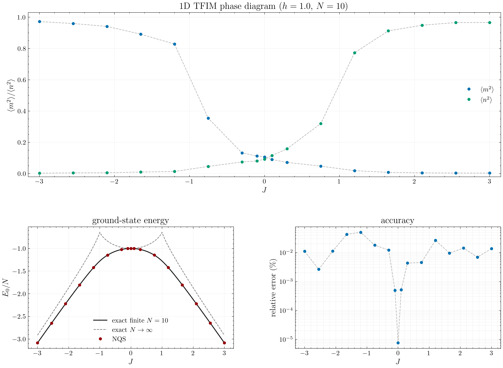

For large negative $J$ the system is in a ferromagnetic phase, indicated by a large value of $\langle m^2 \rangle$ and a vanishing $\langle n^2 \rangle$. As $|J|$ decreases toward zero, both order parameters decrease due to increasing quantum fluctuations induced by the transverse field. Around $J \approx 0$ the system is paramagnetic, where both $\langle m^2 \rangle$ and $\langle n^2 \rangle$ are small. For large positive $J$ the system transitions into an antiferromagnetic phase, where $\langle n^2 \rangle$ saturates near unity while $\langle m^2 \rangle$ approaches zero. The phase diagram is perfectly symmetric under $J \to -J$ because the Ising coupling enters the Hamiltonian quadratically through $\sigma^z_i \sigma^z_j$, and the transformation $\sigma^z_i \to (-1)^i \sigma^z_i$ on alternating sites maps the ferromagnet onto the antiferromagnet.

The lower-left panel shows the ground-state energy per site $E_0/N$. The NQS results closely match the exact finite-size solution and follow the thermodynamic limit prediction $N \to \infty$. The lower-right panel displays the relative error of the NQS energy with respect to the exact finite-$N$ result. The error remains small across the entire parameter range, typically between $10^{-5}$ and $10^{-3}$, and is minimized near the critical region, indicating robust performance even in regimes with strong quantum correlations.

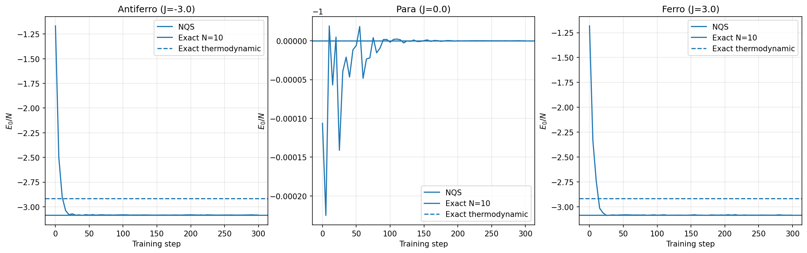

The training convergence plots show the optimization dynamics of the NQS for three representative points in the phase diagram. Each panel displays the evolution of the variational energy per site $E_0/N$ during training. The NQS estimates are shown as discrete points, highlighting the stochastic nature of the optimization process. Two reference lines are included: the exact finite-size result for the system ($N = 4$, solid line) and the thermodynamic limit prediction ($N \to \infty$, dashed line).

In all three regimes the NQS rapidly converges toward the exact ground-state energy within a relatively small number of training steps. The initial fluctuations reflect the stochastic sampling and parameter updates, but these oscillations diminish as training progresses and the model approaches the variational minimum. At $J = 0$ the chain decouples into independent spins in a transverse field with exact energy $E_0/N = -h$, which our NQS reproduces to better than $10^{-4}$ of a percent.

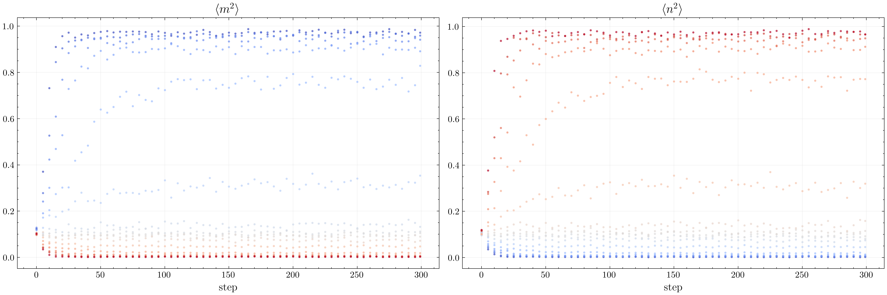

The training history plots show the evolution of the order parameters $\langle m^2 \rangle$ and $\langle n^2 \rangle$ during optimization for different values of the coupling $J$. Each curve corresponds to a separate training run, and the color encodes the value of $J$, ranging from ferromagnetic (blue, $J < 0$) to antiferromagnetic (red, $J > 0$) regimes.

At the beginning of training both order parameters start from similar initial values, reflecting the untrained or weakly structured state of the variational wavefunction. As training progresses the system rapidly organizes into the appropriate phase, and the order parameters evolve toward their characteristic values. For negative $J$, $\langle m^2 \rangle$ quickly increases and saturates near unity while $\langle n^2 \rangle$ is suppressed, indicating ferromagnetic order. Conversely, for positive $J$, $\langle n^2 \rangle$ becomes dominant, signalling antiferromagnetic ordering, while $\langle m^2 \rangle$ approaches zero. Near $J \approx 0$ both quantities remain small, consistent with a paramagnetic phase where no long-range order is present.

The convergence of the order parameters is typically fast, with most of the evolution occurring within the first few tens of training steps. After this initial phase the values fluctuate slightly around their steady-state values due to stochastic sampling in the optimization procedure. The smooth and consistent separation of trajectories across different $J$ shows that the system captures the underlying phase structure and corresponding order parameters throughout training.

---

## 3. The Transverse Field Ising Model

The one-dimensional Transverse Field Ising Model (TFIM) is one of the simplest quantum many-body systems that exhibits a quantum phase transition. It describes a chain of $N$ spin-$\tfrac{1}{2}$ particles with nearest-neighbor Ising interaction and a uniform transverse magnetic field.

The Hamiltonian is:

$$
H = -J \sum_{i=1}^{N} \sigma_i^z \sigma_{i+1}^z - h \sum_{i=1}^{N} \sigma_i^x
$$

where:

- $\sigma_i^x, \sigma_i^y, \sigma_i^z$ are the Pauli matrices acting on site $i$,
- $J$ is the Ising coupling constant ($J > 0$: ferromagnetic, $J < 0$: antiferromagnetic),
- $h$ is the transverse field strength,
- periodic boundary conditions (PBC) are assumed: $\sigma_{N+1} \equiv \sigma_1$.

The Pauli matrices satisfy the algebra:

$$
[\sigma_i^\alpha, \sigma_j^\beta] = 2i\,\delta_{ij}\,\epsilon^{\alpha\beta\gamma}\,\sigma_i^\gamma, \qquad (\sigma_i^\alpha)^2 = \mathbb{1}
$$

Crucially, operators on different sites commute: $[\sigma_i^\alpha, \sigma_j^\beta] = 0$ for $i \neq j$. This will be important during comparison to fermionic operators, which anticommute.

---

## 4. Order Parameters

To distinguish the phases, we measure two order parameters:

### 4.1 Magnetization (Ferromagnetic Order)

$$
m = \frac{1}{N}\sum_i \sigma_i^z
$$

The squared magnetization detects ferromagnetic long-range order:

$$
\langle m^2 \rangle = \frac{1}{N^2}\sum_{i,j} \langle \sigma_i^z \sigma_j^z \rangle
$$

- $\langle m^2 \rangle > 0$: **Ferromagnetic phase** ($J > 0$, $|J| > h$)
- $\langle m^2 \rangle \to 0$: No uniform magnetic order

### 4.2 Néel (Staggered) Magnetization (Antiferromagnetic Order)

$$
n = \frac{1}{N}\sum_i (-1)^i \sigma_i^z
$$

$$
\langle n^2 \rangle = \frac{1}{N^2}\sum_{i,j} (-1)^{i+j} \langle \sigma_i^z \sigma_j^z \rangle
$$

- $\langle n^2 \rangle > 0$: **Antiferromagnetic phase** ($J < 0$, $|J| > h$)
- $\langle n^2 \rangle \to 0$: No staggered order

### 4.3 Phase Diagram Summary

| Regime | $J$ | Condition | $\langle m^2 \rangle$ | $\langle n^2 \rangle$ |
|--------|-----|-----------|----------------------|----------------------|
| Ferro  | $J > 0$ | $\|J\| > h$ | $> 0$ | $\approx 0$ |
| Para   | any | $\|J\| < h$ | $\approx 0$ | $\approx 0$ |
| Antiferro | $J < 0$ | $\|J\| > h$ | $\approx 0$ | $> 0$ |

### 4.4 Higher Moments and the Binder Cumulant

In addition to $\langle m^2 \rangle$ and $\langle n^2 \rangle$, also the fourth moment of the (uniform) magnetization is recoreded

$$
\langle m^4 \rangle = \left\langle \left(\tfrac{1}{N}\sum_i \sigma_i^z\right)^{\!4}\,\right\rangle,
$$

which is needed to form the dimensionless [Binder cumulant](https://en.wikipedia.org/wiki/Binder_parameter) i.e. wie stark die weicht die Verteilung von m von einer Gaußverteilung ab:

$$
U_4 \;=\; 1 \;-\; \frac{\langle m^4 \rangle}{3\,\langle m^2 \rangle^{2}}.
$$

It is dimensionless and has two limiting values:

**Limiting values.** Consider $U_4$ in the two phases, because of the limits a switch between ordered and unordered phase is recognized:

- **(ferromagnetic) phase**, thermal and quantum fluctuations are suppressed and the magnetization is peaks sharpely around the value $\pm m_0$. In that limit $\langle m^4 \rangle \to m_0^4$ and $\langle m^2 \rangle \to m_0^2$, i.e.

  $$
  U_4 \;\longrightarrow\; 1 - \frac{m_0^4}{3\,(m_0^2)^2} \;=\; 1 - \tfrac{1}{3} \;=\; \tfrac{2}{3}.
  $$
dh. two peaks, the probability is a non-gaussian plot, ordered
- **(paramagnetic) phase**, $m$ is approximately Gaussian-distributed around zero. For a zero-mean Gaussian, [Wick's theorem](https://en.wikipedia.org/wiki/Wick%27s_theorem) gives $\langle m^4 \rangle = 3\,\langle m^2 \rangle^2$, hence

  $$
  U_4 \;\longrightarrow\; 1 - \frac{3\langle m^2\rangle^2}{3\langle m^2\rangle^2} \;=\; 0.
  $$
dh. gaussian plot, unordered.

**Numerical example based on training data.** The two limits are visible directly in the $N=64$ results:

| phase        | $J$   | $\langle m^2 \rangle$ | $\langle m^4 \rangle$ | $U_4 = 1 - \langle m^4\rangle/(3\langle m^2\rangle^2)$ |
|---------------|-------|-----------------------|-----------------------|--------------------------------------------------------|
| ferro    | $-3.0$| $0.9734$              | $0.9443$              | $1 - 0.9443/(3\cdot 0.9734^2) = 0.668$                 |
| paramagnetic  | $\;\;0.0$| $0.01634$          | $0.000710$            | $1 - 0.000710/(3\cdot 0.01634^2) = 0.113$              |

The ferro value $0.668$ is indistinguishable from $2/3$ to three significant figures. The paramagnetic value is still a bit above zero because even at $J=0$ a $64$-spin chain has non-zero $\langle m^2 \rangle$ due to fluctuations, but the limit is apprached as $N$ increases.

---

## 5. Background: Jordan-Wigner transformation

Details: https://theory.leeds.ac.uk/interaction-distance/applications/ising/map-to-free/

The 1D transverse-field Ising model (TFIM) can be mapped to a system of free fermions via the Jordan–Wigner transformation. The mapping from spin operators to spinless fermions is given by

$$
c_j = \left( \prod_{l=1}^{j-1} \sigma^z_l \right) \frac{\sigma^z_j + i \sigma^y_j}{2}.
$$

After performing a Fourier transform to momentum space, the Hamiltonian decouples into independent $2 \times 2$ blocks for each momentum $k$:

$$
H = \sum_k \epsilon(k)\,\left(\eta^\dagger_k \eta_k - \tfrac{1}{2}\right),
$$

where the single-particle dispersion (Bogoliubov quasiparticle energy) is

$$
\epsilon(k) = 2 \sqrt{J^2 + h^2 + 2Jh \cos(k)}.
$$

For a system of $N$ sites with periodic boundary conditions, the allowed momenta are

$$
k_n = \frac{2\pi n}{N}, \quad n = 0, 1, \dots, N-1.
$$

The ground-state energy is obtained by summing over all modes:

$$
E_0 = -\frac{1}{2} \sum_k \epsilon(k).
$$

In the thermodynamic limit ($N \to \infty$), this sum becomes an integral:

$$
\frac{E_0}{N} = -\frac{1}{2\pi} \int_0^{2\pi} \sqrt{J^2 + h^2 + 2Jh \cos(k)} \, dk.
$$

This integral can be expressed in terms of the complete elliptic integral of the second kind $E(m)$:

$$
\frac{E_0}{N} = -\frac{2}{\pi} \, \max(|J|, h)\, E(m),
$$

where

$$
m = \left( \frac{\min(|J|, h)}{\max(|J|, h)} \right)^2.
$$

The system undergoes a quantum phase transition at

$$
|J| = h,
$$

which separates the ordered (ferromagnetic or antiferromagnetic) phases from the paramagnetic phase.

---

## 6. Phase Transition

A quantum phase transition happens in the limit $N \to \infty$. To see those trends, multiple $N$ are overlayed to read of the critical quantities.

Near the quantum critical points $|J| = h$ the correlation length $\gamma$ diverges. As soon as $\gamma$ exceeds the system size $L = N$ (with lattice constant $1$), it is effectively gapped by the box, i.e. the boxy behaviour shown in the plot To resolve the transition in detail, the same sweep is repeated for several system sizes $N \in \{4, 8, 16, 32, 64\}$, and the resulting curves are overlaid in a single figure.

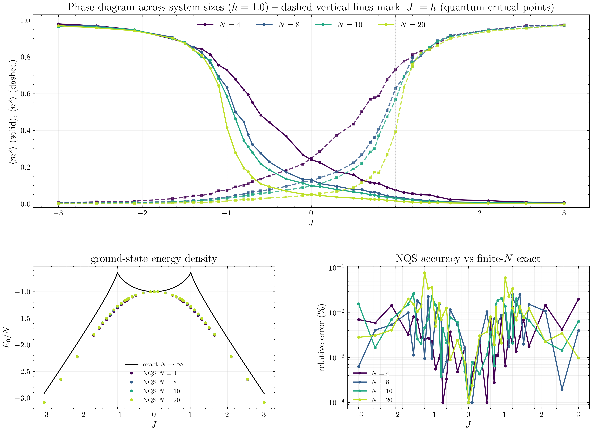

The upper panel shows the order parameters $\langle m^2 \rangle$ (solid) and $\langle n^2 \rangle$ (dashed) as functions of $J$ for all five system sizes. For $|J| \gg h$ the curves are essentially size-independent. The behaviour close to $|J| = h=\pm1$ is markedly different: as $N$ grows, the crossover region narrows and the curves approach a step function, as expected.

The lower-left panel confirms the convergence of the ground-state energy density $E_0/N$ toward the exact $N \to \infty$ elliptic-integral curve. The cusps (a point on a curve where it becomes sharp or pointed) at $J = \pm h$ become increasingly pronounced with $N$.

The lower-right panel displays the relative accuracy of the NQS ground-state energy with respect to the finite-$N$ exact diagonalisation; errors remain in the $10^{-5}$ to $10^{-1}\%$ range across the full sweep and all system sizes. Interesting is, that the error is largest in the critical region, for all values of $N$.

### 6.1 Critical Zoom and Energy Curvature

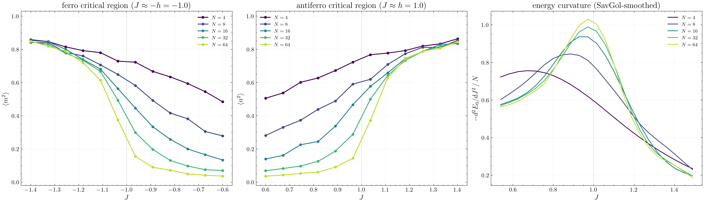

Both left panels show the expected sharpening of the order parameters: the $N = 4$ curve changes smoothly over the full window, while the $N = 64$ curve has already developed a near-discontinuous drop from $\langle m^2 \rangle \approx 0.7$ to $\langle m^2 \rangle \approx 0.05$ within $|J - J_c| \lesssim 0.1$.

The right panel shows $-d^2 E_0/dJ^2$ as a function of $J$ for each $N$ (because to see if it diverges). For a second-order transition the ground-state energy density is continuous at $J_c$ but its second derivative develops a divergent peak in the limit. The numerical curves show exactly this behaviour: the peak height grows monotonically with $N$ and its location converges towards $J_c = 1$. Importantly, $d E_0/dJ$ remains finite and continuous at $J_c$, which neglects a first-order transition (which would produce a finite jump).

**Savitzky–Golay filter** $E''(J) \approx [E(J+h) - 2E(J) + E(J-h)]/h^2$ applied to Monte Carlo data amplifies noise dramatically, because the operator subtracts nearly equal numbers and divides by the small quantity $h^2$. The Savitzky–Golay filter avoids this by first taking a local window (f.ex. three points around) $J_{i-3},\cdots,J_i,J_{i+3}$, applying a polynominal fit $p(J)=a_0+a_1 J+ a_2 J^2\cdots$ and takes the derivative of it $\ddot{p}(J)=2a_2+6a_3 J$.

**Numerical example based on training data** At $N = 64$ take the five consecutive energy points around the antiferromagnetic critical point,

| $J$ | $0.818$ | $0.891$ | $0.964$ | $1.036$ | $1.109$ |
|-----|---------|---------|---------|---------|---------|
| $E_0/N$ | $-1.1752$ | $-1.2106$ | $-1.2499$ | $-1.2966$ | $-1.3485$ |

with uniform spacing $\Delta J \approx 0.0727$. The classical 5-point Savitzky–Golay coefficients for a second derivative at the centre of a window of length 5 (with polynomial order 2 or 3) are $\mathbf{c} = (2, -1, -2, -1, 2)/7$, giving

$$
\left.\frac{d^2 E}{dJ^2}\right|_{J=0.964}
\;\approx\; \frac{\mathbf{c}\cdot\mathbf{E}}{\Delta J^2}
\;=\; \frac{2(-1.175) - (-1.211) - 2(-1.250) - (-1.297) + 2(-1.348)}{7\cdot 0.0727^2}
\;\approx\; -1.09.
$$

A naive three-point central difference on the middle three points of the same data gives $-1.40$ — a $30\%$ larger value in magnitude, driven by the noise in the middle two energies. The Savitzky–Golay estimate averages over all five samples and is visibly closer to the smooth curve seen in the figure (peak height $\approx 1.03$ for $N=64$). In the plotting code there is the same idea used, i.e. a window of $11$ points and polynomial order $3$, applied to a cubic-interpolated grid.

### 6.2 Binder Cumulant

The cleanest finite-size-scaling diagnostic is the Binder cumulant $U_4$ introduced in Section 4.4. The figure below shows $U_4$ against $J$ for all system sizes.

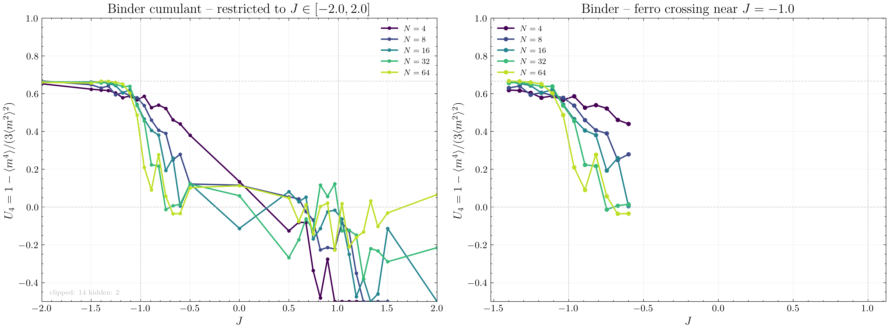

The left panel covers the restricted range $J \in [-2, 2]$ and the right panel zooms on the ferromagnetic critical point at $J = -1$. Because $U_4$ is constructed from the uniform magnetization $m$, it is naturally suited to the ferromagnetic transition; at the antiferromagnetic transition the corresponding quantity would be the staggered Binder cumulant built from $\langle n^4 \rangle$, and $U_4$ of the uniform $m$ is correspondingly noisier for $J > 0$.

Deep in the ferromagnetic phase ($J \ll -h$) all curves approach the value $U_4 = \tfrac{2}{3}$ expected for a fully ordered Ising state, as marked by the upper reference line. In the paramagnetic region the Gaussian limit $U_4 \to 0$ is approached from above.

### 6.3 Finite-Size Scaling of the Order Parameter

At the critical point the order parameter does not vanish instantaneously, the standard prediction of finite-size scaling for the 1D TFIM — which belongs to the 2D classical Ising class — is

$$
\langle m^2 \rangle (J_c, N) \;\sim\; N^{-2\beta/\nu},
\qquad \beta = \tfrac{1}{8},\ \nu = 1 \;\;\Rightarrow\;\; -2\beta/\nu = -\tfrac{1}{4}.
$$

On a log-log plot this should appear as a straight line with slope $-1/4$.

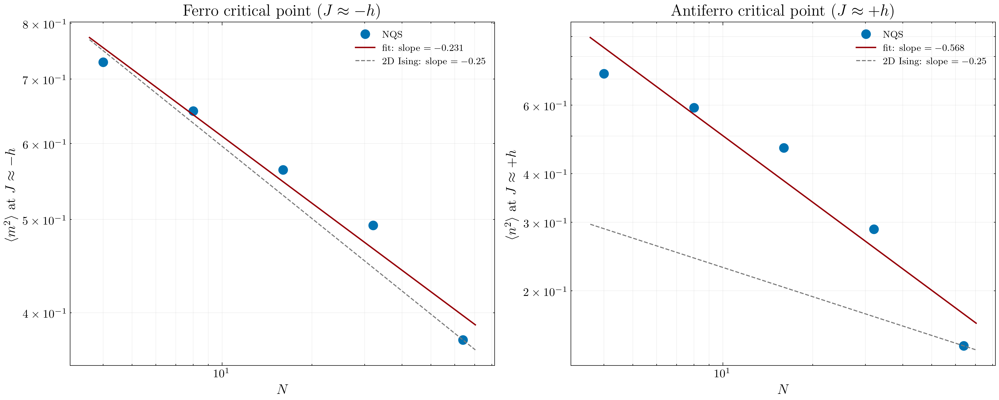

The left panel shows $\langle m^2 \rangle$ at the $J$ value in our grid closest to the ferromagnetic critical point ($J \approx -1.04$), for each $N \in \{4, 8, 16, 32, 64\}$. The fitted log-log slope is $-0.231$, within $8\%$ of the theoretical value $-0.25$ — a quantitative verification of the 2D-Ising critical exponent $2\beta/\nu = 1/4$.

The right panel shows $\langle n^2 \rangle$ at $J \approx +0.96$. The NQS fit gives a steeper slope of $-0.568$, noticeably steeper than the universal $-0.25$. 

### 6.4 Curvature Peak Scaling

Back to the second-order derivate if section 6.1 Two observables can be extracted from the peak at each $N$: its height and its location:

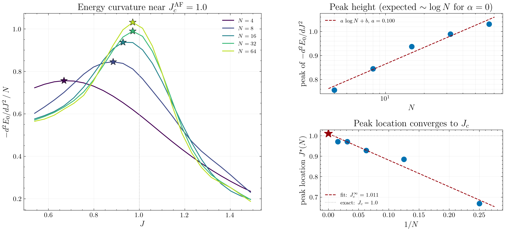

- **Peak height vs $\log N$** (upper right). The exponent for 2D Ising is $\alpha = 0$, which corresponds to a logarithmic divergence. In practice this means the peak height should grow linearly in $\log N$: $\text{peak} \approx a\,\log N + b$. The fit to the training data gives $a \approx 0.10$, with the peak height rising from $\approx 0.76$ at $N=4$ to $\approx 1.03$ at $N=64$.

- **Peak location vs $1/N$** (lower right). On a finite chain the peak sits at some $J^\star(N) \neq J_c$, offset from the true critical point by a finite-size shift $J_c - J^\star(N) \propto 1/N^{1/\nu}$. For the 2D Ising universality class $\nu = 1$, so this shift should be linear in $1/N$. The peak locations fit a straight line in $1/N$ with intercept $J_c^\infty \approx 1.011$, in aggreement with the exact result $J_c = 1.0$. 

### 6.5 Energy Variance and Variational Fidelity

A final diagnostic that uses no order parameter at all is the variational energy variance

$$
\sigma_E^2(J) \;=\; \langle H^2 \rangle - \langle H \rangle^2.
$$

For *any* exact eigenstate of $H$ the variance is strictly zero, because $H|\psi\rangle = E|\psi\rangle$ implies $\langle H^2 \rangle = E^2 = \langle H \rangle^2$. On a variational ansatz the variance therefore plays the role of a fidelity proxy: the smaller $\sigma_E^2$ is at the end of training, the closer the state is to the true ground state. NetKet computes $\sigma_E^2$ as a byproduct of every energy expectation, and we log it at every training step.

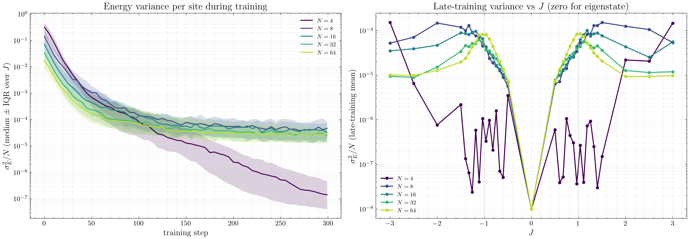

The left panel shows the variance per site $\sigma_E^2 / N$ as a function of training step. For each system size with the median over all $J$ values (solid line) together with the inter-quartile range (shaded band). The variance drops by many orders of magnitude during optimization and levels off at a size-dependent floor by step $\sim 200$, i.e. the training converges

The right panel shows late-training $\sigma_E^2/N$ variance plotted against $J$ for every $N$. 

- **Minimum at $J = 0$.** At $J = 0$ the Hamiltonian reduces to $-h\sum_i \sigma^x_i$, which factorizes over sites and has an exact product-state ground state. The NQS ansatz has more than enough capacity to represent this state exactly, so $\sigma_E^2 / N$ drops essentially to machine zero at $J = 0$ for every $N$.
- **Plateaus in the ordered regions.** Deep in the ferro or antiferro phases the ground state is again close to a product state (the two Ising ordered states, dressed by a small tunneling contribution), and the NQS achieves a uniformly small but nonzero variance of order $10^{-5}$ per site.
- **Peaks at $|J| = h$.** The variance develops clear peaks near the critical couplings $|J| = 1$, and the peak height grows with $N$. This is the exact counterpart of the peak structure seen in $\tau_\text{int}(J)$ and in the energy curvature: the critical ground state has the largest entanglement, the variational ansatz has the hardest time fitting it, and the residual variance per site is correspondingly largest.

---

## 7. Autocorrelation Time of the Monte Carlo Sampler
Successive samples along a chain are not independent; they are correlated over a characteristic timescale known as the integrated autocorrelation time $\tau_\text{int}$. The effective number of independent samples in a chain of length $T$ is

$$
T_\text{eff} \;\approx\; \frac{T}{2\,\tau_\text{int}},
$$

and the statistical uncertainty of a sample-mean estimator for an observable $\mathcal{O}$ scales as

$$
\sigma_{\bar{\mathcal{O}}} \;=\; \sqrt{\frac{2\,\tau_\text{int}}{T}}\,\sigma_\mathcal{O},
$$

where $\sigma_\mathcal{O}$ is the population standard deviation. A large $\tau_\text{int}$ therefore degrades the effective sample size and inflates the statistical error of every measured quantity, including the energy gradient that drives the NQS optimization.

The autocorrelation time is estimated via the standard automated-windowing procedure of Sokal. For a time series $x_1, x_2, \dots, x_T$ first compute the normalized autocovariance

$$
\rho(t) \;=\; \frac{C(t)}{C(0)},
\qquad
C(t) \;=\; \frac{1}{T}\sum_{k=1}^{T-t} (x_k - \bar{x})(x_{k+t} - \bar{x}),
$$

and then define the windowed estimator

$$
\tau_\text{int}(W) \;=\; \tfrac{1}{2} \;+\; \sum_{t=1}^{W} \rho(t).
$$

The Sokal criterion selects the smallest window $W^{\star}$ such that $W^{\star} \geq c\,\tau_\text{int}(W^{\star})$, with $c$ between $4$ and $10$; we use $c = 5$. The final estimate is $\tau_\text{int} \equiv \tau_\text{int}(W^{\star})$.

The window is needed, because naively summing $\rho(t)$ to infinity would give the ideal $\tau_\text{int}$, but estimates of $\rho(t)$ at large $t$ have statistical errors of order $\sqrt{t/T}$ — each additional term eventually contributes more noise than signal. Truncating at a finite window $W$ removes the late-time noise but introduces a bias proportional to the missing tail. Sokal's rule $W \geq c\,\tau_\text{int}(W)$ is a self-consistent way of placing the cutoff far enough out that the bias is negligible (the tail beyond $\sim 5\tau_\text{int}$ is exponentially small), while keeping it short enough that the noise is controlled.

**Example 1 — fast mixing (off-critical).** Take the $N=64$ chain at $J = 0.964$. The normalized ACF decays essentially instantly:

| $t$     | $0$ | $1$   | $2$   | $3$   | $4$    | $5$   |
|---------|-----|-------|-------|-------|--------|-------|
| $\rho(t)$ | $1.000$ | $0.086$ | $0.025$ | $0.001$ | $-0.006$ | $0.012$ |

Walking through the Sokal test:

| $W$ | $\tau_\text{int}(W)$ | $c \cdot \tau_\text{int}(W) = 5\tau$ | $W \geq 5\tau$? |
|-----|----------------------|--------------------------------------|-----------------|
| $1$ | $0.586$              | $2.93$                               | no              |
| $2$ | $0.611$              | $3.06$                               | no              |
| $3$ | $0.613$              | $3.06$                               | no              |
| $4$ | $0.614$              | $3.07$                               | **yes**         |

So $W^\star = 4$ and the reported $\tau_\text{int} = \tau_\text{int}(4) \approx 0.61$, which is safely below one MC sweep — the sampler is producing essentially independent configurations.

**Example 2 — critical slowing down.** Take the $N = 4$ chain at $J = -1.33$, which sits in the narrow window of critical slowing down visible in the $\tau_\text{int}(J)$ figure below. The ACF falls much more slowly:

| $t$     | $0$ | $1$   | $2$   | $3$   | $4$    | $5$    | $8$    |
|---------|-----|-------|-------|-------|--------|--------|--------|
| $\rho(t)$ | $1.000$ | $0.819$ | $0.740$ | $0.665$ | $0.601$ | $0.543$ | $0.403$ |

Applying the same Sokal walk:

| $W$  | $\tau_\text{int}(W)$ | $5\tau$ | $W \geq 5\tau$? |
|------|----------------------|---------|-----------------|
| $1$  | $1.32$               | $6.60$  | no              |
| $5$  | $3.87$               | $19.3$  | no              |
| $10$ | $5.90$               | $29.5$  | no              |
| $40$ | $8.91$               | $44.5$  | no              |
| $50$ | $8.75$               | $43.8$  | **yes**         |

The criterion is only satisfied around $W^\star \approx 45$, giving $\tau_\text{int} \approx 8.8$ MC steps — more than an order of magnitude slower mixing than the off-critical example, and the reason one expects MCMC to slow down near a continuous phase transition.

**Results.** First, NetKet reports an online estimate $\tau_\text{corr}$ of the energy autocorrelation alongside every expectation-value evaluation during training. Recording this quantity at each logging step tells us whether the sampler is well-mixed as the variational parameters evolve.

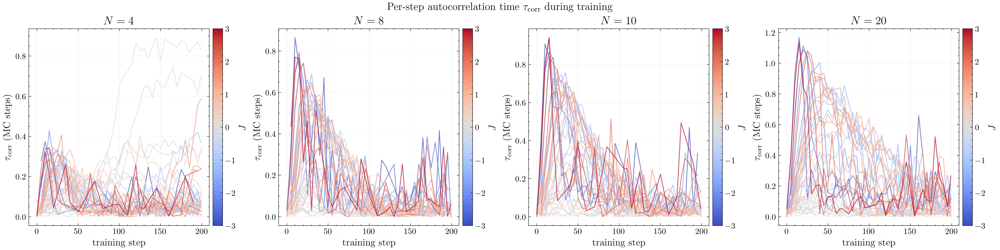

Each subplot corresponds to one system size, and the curves are coloured by the value of $J$, ranging from ferromagnetic (blue, $J < 0$) through paramagnetic (grey, $J \approx 0$) to antiferromagnetic (red, $J > 0$). A common pattern emerges across all $N$: at the very first training steps the sampler has to adapt to a rapidly changing variational state and $\tau_\text{corr}$ transiently rises, but by step $\sim 50$ the autocorrelation has largely settled to a small value. There is no strong systematic trend with $N$ on the scale of the training loop, but the points closest to the critical couplings $|J| = h$ (roughly the purple/red extremes of the colour range near $J = \pm 1$) consistently show the highest plateau — a weak in-training hint of the critical slowing down that resolves more cleanly in the dedicated post-training analysis below.

Second, once training has converged at a given $(N, J)$ point we draw a long dedicated Markov chain from the sampler and compute the integrated autocorrelation time of the local-energy series by applying the Sokal windowing procedure described above.

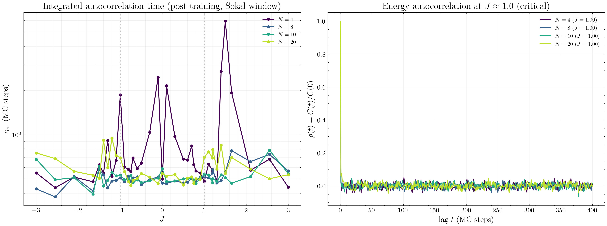

The left panel shows $\tau_\text{int}(J)$ on a logarithmic scale for every system size, with the dotted vertical lines marking the quantum critical points. Deep in the ordered or paramagnetic regions the sampler decorrelates within less than one Metropolis sweep, which is the ideal regime for Monte Carlo estimation. Narrow peaks develop near $J = \pm 1$ at all system sizes, where the chain requires several MC steps to decorrelate. This is the phenomenon of **critical slowing down**: near a continuous phase transition the correlation length of the physical state diverges, which drives the MCMC dynamics towards a long-tailed transition-time distribution. Physically, the variational wavefunction near criticality is spread out over a large, rugged basin of the Hilbert space, and the local spin-flip updates of `MetropolisLocal` are less effective at moving between typical configurations.

The right panel shows the normalized autocorrelation function $\rho(t) = C(t)/C(0)$ at the antiferromagnetic critical point $J \approx +1$ for every system size. The curves fall to zero within a handful of MC steps, consistent with the small $\tau_\text{int}$ values reported in the left panel. For a qualitatively stronger signature of critical slowing down at larger $N$ one would need to approach significantly larger system sizes (which is beyond the scope of this project), where the local sampler is expected to struggle more noticeably with the long-range correlations of the critical state.

Taken together, the three panels in the autocorrelation analysis confirm that `MetropolisLocal` mixes very efficiently for the 1D TFIM at the sizes considered here, with $\tau_\text{int}$ never exceeding order-one MC steps except in narrow windows around the critical couplings. This justifies the use of the reported NQS estimates as essentially independent Monte Carlo averages.
